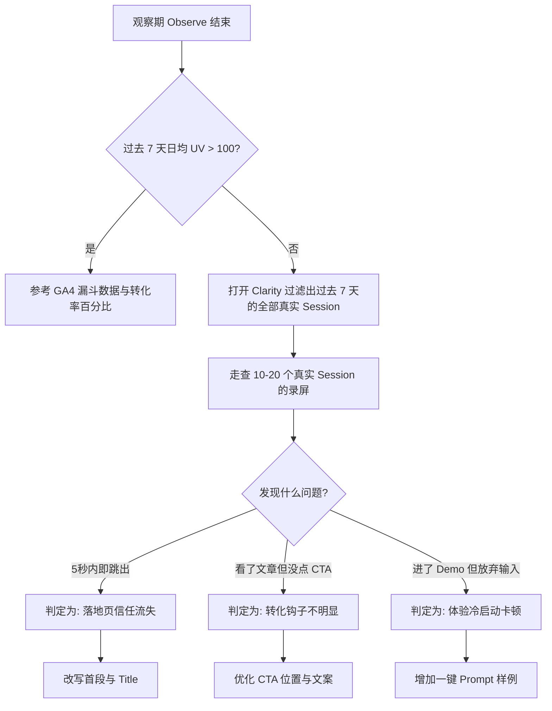

# 微量流量冷启动行为审计与走查实操指南 (Micro-Traffic Session Audit Guide)

当网站处于冷启动阶段，日均真实访客（UV）在 10 ~ 100 之间时，传统的 GA4 数据漏斗和统计学转化率（例如“转化率 3%”）将彻底失效。因为在极小样本量下，大数定律不成立，单个用户的偶发行为会产生极大的统计噪声。

本指南旨在规范在 **Observe（观察）** 向 **Decide（决策）** 状态流转时，Mike 与 AI 团队如何通过用户交互录屏（如 Microsoft Clarity 的 Honest Feedback）进行微观行为审计。

---

## 一、 为什么小流量下必须废弃“统计报表”，改用“行为走查”？

*   **统计失真**：如果今天只有 10 个用户访问，其中 1 个用户因为接电话把网页挂着 1 小时，您的“平均停留时长”就会被拉高到极不真实的水平；如果 1 个用户误触了 3 次按钮，您的“事件发生率”就会翻三倍。
*   **黑盒困境**：统计数据只能告诉你“用户在第 2 步流失了”，但不能告诉你“用户是因为找不到输入框提示（冷启动障碍）、还是因为按钮在 iPhone SE 屏幕上被遮挡了”流失的。
*   **行为走查的本质**：把每一次真实用户的访问（Session）当成一次**用户访谈**。通过还原其鼠标轨迹、滚动深度和点击热力图，诊断出物理产品设计上的硬伤。

---

## 二、 三大核心用户行为卡点审计规范

在走查用户行为录屏时，必须重点盯防以下三个关键节点：

### 卡点一：阅读与信任流失（The "Reading & Trust" Checkpoint）
当用户从 Google 搜索结果（例如 `webhook retry logic`）落地到博客文章时，审计其阅读行为：
*   **停留时长与跳出速度**：用户是 3~5 秒内迅速划走并关掉页面（说明文章排版差、废话多，或首屏没能吸引他），还是停留了 30 秒以上？
*   **滚动深度 (Scroll Depth)**：用户是否滚动到了核心技术细节区域（例如 Webhook 的 4 次重试延迟代码块、HMAC-SHA256 签名部分）？
    *   *决策动作 (Decide)*：如果大部分用户在首屏即跳出，必须**重构引言**，在首段直入主题，并减少无关的铺垫；如果滚动深度极浅，说明排版缺乏视觉呼吸感，需增加图表或代码加粗。
*   **鼠标悬停行为 (Reading Hover)**：用户的鼠标是否跟随文字移动？这代表了他们是在认真精读，还是在无目的的划水。

### 卡点二：转化意图中断（The "Intent Interruption" Checkpoint）
当用户读完了文章，准备进一步体验产品时，审计其向主流程转化的意图：
*   **CTA（呼吁行动）曝光与悬停**：用户是否滚动到了指向 `/use-cases/webhook-form-builder-retry-logs` 或 `/forms/new` 的主 CTA 按钮处？他们的鼠标是否在按钮上悬停（Hover）了但最终没有点击？
    *   *决策动作 (Decide)*：如果鼠标悬停但未点击，通常是因为“转化说服力不足”或“CTA 文字含糊”（例如写了 Get Started，但用户不知道点击后会发生什么）。需改写 CTA 文案为更具行动导向的表述，如 `Try Interactive Demo (Free)`。
*   **点击未响应（Rage Clicks / Dead Clicks）**：用户是否在页面某些非按钮区域（如示意图、无链接的文本）进行了连续点击？
    *   *决策动作 (Decide)*：如果用户试图点击某个示意图，说明他们期望该图能放大或有链接，应立即为该区域补上跳转。

### 卡点三：Demo 流程受挫（The "Demo Frustration" Checkpoint）
当用户成功被引导至 `/forms/new`（一句话生成表单）或 Demo 体验页面时，审计其激活行为：
*   **输入框冷启动停顿**：用户进入页面后，光标在输入框闪烁，但停顿了 10 秒以上仍未打字，最后关闭页面。
    *   *决策动作 (Decide)*：这表明用户遇到了“灵感空白”——他们不知道该输入什么。必须立刻在输入框下方或内部，提供 3~4 个可一键点击的 Prompt 示例标签（例如：*“生成一个客户满意度调研表”*、*“生成一个活动报名表”*）。
*   **提交后的等待焦虑**：用户点击“Generate”按钮后，页面在进行 AI 生成时，用户的鼠标是否在到处乱晃，或频繁刷新网页？
    *   *决策动作 (Decide)*：这说明 AI 生成的 Loading 动画不够明确或时间过长，导致用户产生“系统死机”的错觉。必须优化 Loading 状态的微动画，展示“正在设计表单结构...”、“正在配置 Webhook 路由...”等分步文案，提供心理安抚。

---

## 三、 Decide 决策期与走查动作的结合（日均 UV < 100 时的标准动作）

在 `Observe`（观察期）结束进入 `Decide`（决策期）时，Mike 应当按照以下标准流图操作，不要仅看 GA4 的数字：

通过这一套微观走查指南，我们在冷启动期能够把每一个辛辛苦苦获取进来的 Google 点击榨干，找到最真实、最直观的产品改进点。
