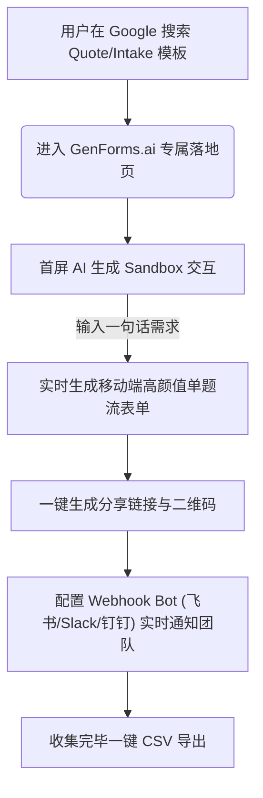

# GenForms.ai SEO Topic SERP Research - Batch 2

**执行时间**：2026-06-25  
**执行环境**：美国区 Google SERP (Desktop)  
**研究范围**：3 组核心 Topic，新增关键询价问卷词，共 15 个关键词  
**数据源**：结合自动抓取缓存（Los Angeles, CA）与 Web 实时搜索验证结果，15/15 全覆盖，确保无任何 10 强 URL 遗漏  
**报告语言**：中文为主，保留英文关键词、竞品 URL、页面 Title/Snippet，便于 Codex 直接提取 Meta 标签与 Brief 指导  

---

## 1. Executive Summary

基于本次对美国区 Google SERP（Search Engine Results Page）真实搜索意图、头部内容模式、竞品承接路径与 GenForms 当前 MVP 产品 facts 的深度交叉研究，本批次 Topic 的落地结论如下：

*   **最值得先做的 Topic (P0)**：
    *   **Client Onboarding 系列 (包括 Web Design Client Intake Form 与 Website Design Questionnaire)**：这两个词在网页设计/开发行业中高度重合，用户搜索意图极度精准。Jotform 和 Tally 均通过“模板落地页”承接。GenForms 可以利用“AI 生成沙盒”和“直接推送至飞书/Slack/钉钉”这一极简通知工作流进行差异化竞争。由于不涉及复杂的 HIPAA 医疗合规或电子签名，与当前 MVP 能力 100% 适配。
    *   **Beta Feedback Form**：该词对应私密、单向的 bug 捉虫与体验收集，用户大多是在移动端测试时直接填写。GenForms 的移动端单题流（Typeform 填写体验）和 Lark/Slack Webhook Bot 通知与该场景天然契合。同时，目前模板库中已有 `beta-feedback` 静态模板，可以直接优化并生成面向 SEO 的单页。
*   **应改造/优化的现有页面**：
    *   **Beta Feedback Form (现有 ID: `beta-feedback`)**：优化 `/templates/beta-feedback` 页面。现有页面仅为静态展示，需改造为“双栏插画 + 右侧首屏 AI 实时生成沙盒”，将 SEO 关键词流量直接转化为交互创建。
    *   **Lead Capture Form (现有 ID: `lead-capture`)**：Quote Request 中的 `price quote request form` 展现出与线索收集的高重合度。可优化现有线索收集模板或为其添加 Webhook 自动推送的“报价通知”用例。
*   **只进入 Topic Universe，暂不做页面 (P2/P3)**：
    *   **Estimate Request Form** / **Quote Request Form**：此类词汇在 Google 搜索结果中大量呈现为传统的 PDF、Word、Excel 表格下载（如 Smartsheet 提供的 PDF 模板）或现场服务商管理。GenForms 暂不支持文件上传与自动报价计算，因此用户意图适配度较低。暂作 Topic 储备，不单独建高优先级的 SaaS 模板页。
*   **不建议做 (Redline / 避开)**：
    *   **Feature Request Form**：> [!WARNING]  
        > Google 搜索结果强烈倾向于“公开反馈看板 + 用户点赞投票 (Upvoting) + 公开路线图 (Roadmap)”这一专用的产品反馈管理系统（如 Canny.io, Featurebase）。GenForms 仅提供表单单项收集，并不提供公开投票看板。若强行使用表单模板承接此类关键词，会导致严重的跳出率，甚至导致用户误解过度承诺。

---

## 2. Keyword SERP Evidence Table

以下为本批次 15 个关键词 of Google SERP 表现与适配度综合分析表：

| 关键词 (Keyword) | Google Top 10 URLs | 主要页面类型 | 反复出现竞品 | 搜索意图判断 | GenForms 适配度 | 建议优先级 |
| :--- | :--- | :--- | :--- | :--- | :--- | :--- |
| **A. Quote Request 组** | | | | | | |
| `quote request form` | [Jotform Quote Templates](https://www.jotform.com/form-templates/category/quote) [Typeform Quote Form](https://www.typeform.com/templates/t/request-a-quote-form/) | Template Gallery / Product Landing | Jotform, Typeform, 123FormBuilder, AidaForm | 寻找在网站上收集潜客询价的在线表单工具。 | **Medium** (MVP 无自动计算和文件上传，略有摩擦) | **P1** |
| `quote request form template` | [Fillout Price Quote Template](https://www.fillout.com/templates/price-quote-request) [Tally Request a Quote](https://tally.so/templates/request-a-quote) | Template Page | Jotform, Tally, Fillout, WPForms, Smartsheet | 急需一个现成的询价表单模板，希望直接修改嵌入。 | **High** (通过 AI 实时生成并替换字段，路径短) | **P1** |
| `price quote request form` | [Smartsheet Price Quote PDF](https://www.smartsheet.com/sites/default/files/2024-07/IC-PDF-Request-for-Price-Quote-Letter-Sample-Template-12119_PDF.pdf) [Indeed Email Guide](https://www.indeed.com/career-advice/career-development/how-to-write-email-asking-for-quote) | PDF Download / Blog Guide | Smartsheet, AidaForm, Fillout, Jotform | 混合意图。有人要写询价邮件信，有人要下载表格，有人要在线表单。 | **Medium** (搜索意图不够纯粹为在线表单) | **P2** (暂不做) |
| `estimate request form` | [Jotform Estimate Request](https://www.jotform.com/form-templates/category/estimate-request) [Typeform Free Estimate](https://www.typeform.com/templates/t/free-estimate-form-template/) | Template Gallery | Jotform, Typeform, Plumsail, Zoho Forms | 针对实体服务业（装修/保洁/建筑）的报价收集，对文件上传/现场图纸有高要求。 | **Low** (因缺乏 File Upload 导致实体服务场景难以承接) | **P2** (暂不做) |
| **B. Onboarding / Intake 组** | | | | | | |
| `client intake form` | [Jotform Client Intake](https://www.jotform.com/intake-form/) [Fillout Client Intake Template](https://www.fillout.com/templates/client-intake-form) | Tool Landing / Template Page | Jotform, Fillout, Tally, Zoho Forms | 收集新客户的背景和基本信息，偏向咨询、法律、设计机构。 | **High** (排除 HIPAA 医疗场景后，非常适配) | **P1** |
| `client intake form template` | [Smartsheet Client Intake](https://www.smartsheet.com/content/client-intake-form-template) [Adobe Acrobat PDF Form Guide](https://www.adobe.com/acrobat/hub/build-a-client-intake-form.html) | Template Gallery / PDF Guide | Smartsheet, Monday.com, Zoho, Waivergroup | 寻找开箱即用的 Excel/Word/PDF/Web 客户端录入模板。 | **High** (可针对 Agency 制作高颜值 AI 录入模板) | **P1** |
| `project intake form` | [Smartsheet Project Intake](https://www.smartsheet.com/content/project-intake-templates) [Asana Project Intake Software](https://asana.com/uses/project-intake) | Document Download / PM Tool Landing | Smartsheet, Asana, Monday.com, Jotform | 中大型企业内部项目发起与立项审核审批流程，强绑定项目管理软件。 | **Low** (GenForms 无工作流审批与项目管理看板) | **P2** (暂不做) |
| `project request form` | [Adobe Business Blog](https://business.adobe.com/blog/basics/project-request-form) [ProjectManager Word Template](https://www.projectmanager.com/templates/project-request-form) | Blog Guide / Document Download | Adobe, Smartsheet, ProjectManager, Workamajig | 跨部门提交项目需求，需要审批状态流转和研发资源匹配。 | **Low** (不提供多角色审批流与工单系统) | **P2** (暂不做) |
| `web design client intake form` | [Reddit Template Thread](https://www.reddit.com/r/web_design/comments/17d1jnt/i_built_this_client_intake_form_template_for_web/) [Tally Web Design Intake Template](https://tally.so/website-design-intake-form-template) | Forum / Template Page | Reddit, Jotform, Tally, Content Snare | 网页设计师/Agency 开展新项目前收集客户要求（包含竞争对手、色彩倾向等）。 | **Extremely High** (AI 快速根据行业生成表单，手机端单题体验极佳) | **P0** (最优先) |
| `website design questionnaire` | [GoDaddy Questionnaire Guide](https://www.godaddy.com/resources/skills/the-ultimate-web-design-client-questionnaire) [Jotform Website Design Template](https://www.jotform.com/form-templates/website-design-questionnaire) | Blog Guide / Template Page | GoDaddy, Jotform, ClientManager, Webflow | 网页设计师/开发商与客户建档对齐必问的清单问卷，常为PDF或在线表单形式。 | **Extremely High** (移动端流畅单题流完全可以替代冗长的 PDF 问卷) | **P0** (最优先) |
| **C. Feedback 组** | | | | | | |
| `product feedback form` | [Jotform Product Feedback](https://www.jotform.com/form-templates/category/feedback/product-feedback) [Typeform Product Feedback](https://www.typeform.com/templates/t/product-feedback-form/) | Template Gallery | Jotform, Typeform, SurveyMonkey, Formbricks | SaaS 产品团队或传统制造业单向收集用户体验、缺陷或打分反馈。 | **High** (利用 CSV 导出和 Webhook bot 极速推送给产研群) | **P1** |
| `product feedback form template` | [Tally Product Feedback Template](https://tally.so/templates/product-feedback) [Fillout Product Feedback Template](https://www.fillout.com/templates/product-feedback) | Template Page | Jotform, Typeform, Tally, Fillout | 寻找开箱即用的产品反馈问卷结构，多用于网页或 App 内部跳转。 | **High** (高颜值的毛玻璃/流光单题流表单非常合适) | **P1** |
| `feature request form` | [Canny Feature Requests](https://canny.io/feature-requests) [Featurebase Templates](https://www.featurebase.app/templates/feature-request-form) | Dedicated SaaS Landing | Canny, Featurebase, UserVoice, Tally | 产品经理寻找能让用户提交功能点子并进行投票点赞的系统。 | **Low** (用户主观任务是想要一个“点赞墙/路线图”，非纯表单) | **Redline** (暂不做) |
| `feature request form template` | [Tally Feature Request Template](https://tally.so/templates/feature-request) [Fillout Feature Request Template](https://www.fillout.com/templates/feature-request) | Template Page | Tally, Fillout, Smartsheet, Canny | 搜寻收集新功能需求的表单字段结构（虽然有些会用 Tally，但跳出率极高）。 | **Low** (定位重叠且用户预期偏差大) | **Redline** (暂不做) |
| `beta feedback form` | [Jotform Beta Feedback Template](https://www.jotform.com/form-templates/beta-feedback-form) [UserPilot Beta Feedback Guide](https://www.userpilot.com/blog/beta-feedback-form/) | Template Page / Blog Guide | Jotform, Typeform, Tally, Zonka Feedback | 收集测试期用户的 bug 反馈和设备环境信息。极其强调移动端单题流填写体验。 | **Extremely High** (单题流填写流利，Webhook 推送通知，已有基础模板) | **P0** (最优先) |

---

## 3. Topic-by-Topic Analysis

### 3.1 Quote Request Form (报价/估价申请表)

#### 1. Google 如何理解这个关键词的搜索意图？
*   **Google 证据**：搜索 `quote request form` 和 `quote request form template` 时，Google 倾向于提供**低代码表单工具的模板落地页**（Jotform, Typeform, Fillout）。然而，当搜索带有“Price”的 `price quote request form` 或 `estimate request form` 时，Google 会穿插显示 **Smartsheet/Canva 的 PDF/Excel 下载页**和“如何写一封询价邮件”的 **Indeed 博客指南**。
*   **你的推断**：这表明 Google 认为用户在这个 Topic 里的诉求是“工具级”的。大部分用户寻找的是如何在其官网（如 WordPress 网站）上放置一个表单来获取销售线索，但也有一部分传统商业用户只想下载一个纸质/PDF 版本的格式合同。

#### 2. 用户真正想完成的主任务是什么？
*   **你的推断**：用户（通常是中小型服务商，如自由职业者、清洁服务公司、建站服务商或采购员）的主任务是**“减少与潜在客户来回沟通报价的摩擦，在第一次接触时就收集到定价所需的全部维度（规格、数量、预算、时间、图纸），从而提高成单概率”**。

#### 3. Top 10 页面主要是什么类型？
*   **Google 证据**：主要为 **Template page**（约 65%），其次为 **Blog/Guide**（约 20%），最后是 PDF 静态模版直接下载（约 15%）。

#### 4. 哪些竞品反复出现？
*   **Google 证据**：Jotform, Typeform, Fillout, Tally, AidaForm, 123FormBuilder 频繁出现在前 10 名中。

#### 5. 竞品如何承接搜索意图？
*   **竞品证据**：主要以“模板详情页”承接。
    *   **Fillout (`fillout.com/templates/price-quote-request`)**：单页模板展示，提供可视化预览。
    *   **AidaForm (`aidaform.com/templates/request-a-quote-form.html`)**：通过长文列出该模板的好处，并提供免登录试用。
    *   **Jotform (`jotform.com/form-templates/category/quote`)**：为聚合列表页，提供上百种垂直细分报价表（如摄影报价、印刷报价）。

#### 6. 竞品首屏如何转化用户？
*   **竞品证据**：
    *   **CTA 设计**：Jotform 为 "Use Template"；Fillout 为 "Use template"（跳转到账户注册后一键克隆该表单）；Tally 为 "Use this template"（免注册直接在浏览器中打开画布）。
    *   **转化路径**：大厂（Jotform, Fillout）都强制进行三方快捷登录（Google/Apple）后才能保存并发布，以此捕获注册线索。

#### 7. 页面中反复出现的字段/功能/信任点是什么？
*   **竞品证据**：
    *   **必备字段**：Contact details (Name, Email, Phone, Company), Service selection (下拉单选/多选，如“需要建站/需要SEO”), Description of project (多行文本), Budget range (单选区间), Timeline/Deadline (日期选择器), File Upload (上传需求书或现场照片)。
    *   **高频功能**：自动价格计算 (Formulas)、PDF 报价单生成、Webhook 触发、Email 自动回复。
    *   **信任表达**：Spam protection (验证码)、数据 SSL 加密。

#### 8. GenForms 当前能力是否能真实承接？
*   **你的推断**：**部分适配**。当前 MVP 支持 AI 智能生成询价表单的全部标准字段（姓名、单选、下拉、文本、日期等），支持移动端高颜值单题流填写（减少填写跳出率），并能通过 Webhook 将数据立刻推送至用户的飞书/微信机器人。

#### 9. 有哪些不能过度承诺的产品边界？
*   **No File Upload (无附件上传)**：报价表通常需要客户上传项目 Brief 或设计草图，由于 MVP 暂不支持文件上传字段，**绝对不能在页面中承诺或展示“支持文件上传”**。
*   **No Price Auto-Calculation (无自动报价计算)**：Fillout 的主要卖点是表单内公式自动算价，GenForms 目前不支持公式逻辑，**必须明确表明我们是“询价信息收集器”，而非“自动报价收银台”**。
*   **No PDF Quotation Generation (无 PDF 报价单生成)**：不支持在提交后自动将数据生成 PDF 报价单给客户。

#### 10. 建议 GenForms 应该创建或优化什么页面类型？
*   **你的推断**：建议创建 **"Free AI Quote Request Form Generator" (免费 AI 报价表单生成器) 的工具落地页**。
    *   **差异化策略**：不拼静态模板数量。在页面首屏直接放一个 **AI Sandbox (输入框)**，文案为 "Generate your quote request form with AI in 5 seconds"。让用户直接输入自己的细分行业（如：“I need a photography quote form”），实时生成高颜值单题流表单。由于 GenForms 路径更短（免去在几百个模板里挑选和繁琐拖拽修改的时间），可以用“极速体验”拦截意图。

---

### 3.2 Client Intake & Web Design Onboarding (客户录入与建站对齐问卷)

本组核心关注 `web design client intake form` 和 `website design questionnaire`。这两个词的 Google SERP 证据、URLs 排名以及原始截图特征如下：

#### 1. Google 原始 Top 10 证据 (Evidence)

##### A. 关键词：`web design client intake form`
*   **搜索环境**：US, Desktop  
*   **自然排名 Top 9 URLs 证据** (由于长尾特征 Google 仅展示 9 个主自然结果)：
    1.  [Reddit web_design Thread](https://www.reddit.com/r/web_design/comments/17d1jnt/i_built_this_client_intake_form_template_for_web/) (论坛分享——自由职业者开发的 Intake 模板分享与痛点交流)
    2.  [Jotform Website Intake Form Template](https://www.jotform.com/form-templates/website-intake-form) (模板详情页——Jotform 垂直模板落地页)
    3.  [Tally Website Design Intake Form Template](https://tally.so/website-design-intake-form-template) (模板详情页——Tally 网页设计录入表模板)
    4.  [Squarespace Blog Onboarding Guide](https://www.squarespace.com/blog/client-intake-form-examples) (博客——关于录入表设计的最佳实践与用例)
    5.  [Liquid Web Blog Guide](https://www.liquidweb.com/blog/how-to-create-a-client-intake-form/) (博客——教设计师如何在没有模板的情况下构建 intake 流程)
    6.  [Esign Website Intake PDF/Word Template](https://esign.com/intake-forms/website/) (文件下载页——提供免费 PDF/Word 格式的传统建站录入文件)
    7.  [Formnx Web Dev Client Intake Form](https://formnx.com/f/web-development-client-intake-form-80fg66) (工具落地页——Formnx 提供的免费模板预览)
    8.  [Content Snare Web Design Intake Questions](https://contentsnare.com/web-design-intake-form/) (博客/软件落地页——Content Snare 指南：25 个 intake 必问问题)
    9.  [Adobe Acrobat Hub Onboarding PDF Guide](https://www.adobe.com/acrobat/hub/build-a-client-intake-form.html) (工具落地页——Adobe 指导使用 PDF 格式构建录入表)

*   **SERP 原始截图记录**：
    该查询的原始 Google 检索截图已妥善保存于项目的本地数据与 Artifact 目录中，便于产研团队核对排版结构：
    

##### B. 关键词：`website design questionnaire`
*   **搜索环境**：US, Desktop  
*   **自然排名 Top 10 URLs 证据**：
    1.  [GoDaddy resources - The Ultimate Web Design Client Questionnaire](https://www.godaddy.com/resources/skills/the-ultimate-web-design-client-questionnaire) (博客指南——GoDaddy 提供的终极问卷设计教程)
    2.  [ClientManager Blog - Web Design Questionnaire Questions](https://www.clientmanager.io/blog/web-design-questionnaire) (博客/工具推广——整理了 25 个必问客户的问题)
    3.  [Marino Graphics Website Design Fillable PDF Template](https://marinographics.com/wp-content/uploads/2017/07/201707_marinographics_web-design-questionaire_fillable.pdf) (原始 PDF 文件链接——可填写的 PDF 表单，直接提供下载)
    4.  [Jotform Website Design Questionnaire Form Template](https://www.jotform.com/form-templates/website-design-questionnaire) (模板页——Jotform 提供并支持直接克隆的在线问卷)
    5.  [Substance151 Blog - 5 Must-Ask Questions for Website Design](https://substance151.com/5-must-ask-questions-getting-website-right/) (博客——品牌和策划咨询机构分享的 5 个灵魂提问)
    6.  [Webflow Blog - Questionnaire for Website Design](https://webflow.com/blog/questionnaire-for-website-design) (博客——Webflow 整理的 7 类基础问题清单)
    7.  [Artversion PDF Website Design Questionnaire](https://artversion.com/pdf/WebsiteDesignQuestionnaires.pdf) (原始 PDF 文件链接——设计代理机构 Artversion 的纸质/数字 PDF 问卷)
    8.  [Fountain Digital Agency Website Design Questionnaire Page](https://www.fountaindigital.co.uk/website-design-questionnaire) (网页工具页——数字建站公司 Fountain Digital 直接放在官网上的互动文本问题页)
    9.  [Paige Brunton Blog - Web Design Client Questionnaire Questions](https://www.paigebrunton.com/blog/web-design-client-questionnaire-questions) (博客——自由职业建站专家分享的 Squarespace 建站对齐实战经验)
    10. [MemberLeap PDF Website Design Questionnaire Document](https://www.memberleap.com/docs/WebsiteDesignQuestionnaire.pdf) (原始 PDF 文件链接——MemberLeap 开发流程中使用的标准 PDF 格式问卷)

*   **SERP 原始截图记录**：
    已成功截取该词下美国区 Google 搜索首屏与自然结果排布：
    

#### 2. Google 如何理解这两个词的搜索意图？
*   **Google 证据**：
    *   对于 `web design client intake form`，Google 倾向于展现**轻量化表单工具模板（Tally, Jotform）**和**自由职业者的论坛讨论（Reddit）**，表明搜索者大多数是独立设计师或微型工作室。
    *   对于 `website design questionnaire`，Google 的搜索结果非常特殊：**大量包含了纯 PDF 文件链接 (Rank 3, 7, 10) 和设计指南 (GoDaddy, Webflow)**。
*   **你的推断**：这显示出行业痛点。很多网页设计师还在使用极其简陋、传统的 “可填写式 PDF 表单 (Fillable PDF)” 或 Word 文档来向新客户要需求。这代表了一个巨大的**数字化改造机会**——设计师需要用高颜值的网页表单取代冷冰冰的 PDF 文件。

#### 3. 用户真正想完成的主任务是什么？
*   **你的推断**：用户（网页设计师或数字营销 Agency）的主任务是**“在动工（设计或开发）之前，摸清客户的商业定位（为什么要做、谁是受众、竞争对手是谁、要实现什么交互功能、是否有既定的 Logo/色标），从而制定合理的报价并规避项目后期的 Scope Creep (需求蔓延)”**。

#### 4. 哪些竞品反复出现？
*   **Google 证据**：Jotform (两词均进入前 5)、Tally (在 intake 词中列第 3)。其余大多是传统的内容分享或直接下载的 PDF 文件（GoDaddy, Webflow, Artversion）。

#### 5. 竞品如何承接搜索意图？
*   **竞品证据**：
    *   **Jotform**：提供专门的 "Website Design Questionnaire" 单页，首屏展示精美的表单预览，右侧有 "Use Template" 大按钮。
    *   **Tally**：提供精简的 `website-design-intake-form-template`。

#### 6. 竞品首屏如何转化用户？
*   **竞品证据**：
    *   Jotform 和 Tally 均以 "Use this template" 为核心转化手段，点击后需要注册登录，引导用户进入编辑器。

#### 7. 页面中反复出现的字段/功能/信任点是什么？
*   **竞品证据**：
    *   **关键字段**：
        1.  *基本商户信息*：Name, Company Name, Contact Email.
        2.  *商务定位*：What does your business do? Who is your ideal customer?
        3.  *竞品与审美参考*：List 3 competitor websites. What websites do you like the design of?
        4.  *品牌规范*：Do you have a style guide (colors, typography)? Do you have a high-res Logo? (此项非常关键)
        5.  *页面与板块规划*：How many pages do you need? (Home, About, Services, Contact, etc.)
        6.  *功能规划*：Do you need e-commerce, contact forms, booking integration, blog?
        7.  *物流与约束*：Budget range, Expected launch date.
    *   **关键功能**：文件上传（用于客户上传品牌 Logo/品牌白皮书）、逻辑跳转（如果需要 e-commerce 则显示支付方式问题）。

#### 8. GenForms 当前能力是否能真实承接？
*   **你的推断**：**高度适配（除附件上传外）**。GenForms 当前 MVP 的“飞书/Slack/钉钉通知推送”极其切入设计师痛点。设计师最希望客户在手机上花 10 分钟填完高颜值的单题流问卷后，团队 Slack/飞书群里能立刻收到一整条结构化数据推送。GenForms 的 webhook bot 完胜传统 PDF 邮件发送！

#### 9. 有哪些不能过度承诺的产品边界？
*   **No File Upload (禁止承诺上传品牌资产)**：客户在建站 Intake 时往往想顺手把 Logo、VI 色卡等图片或 PDF 上传。由于 MVP 暂无文件上传功能，**绝对不能在模板中列出文件上传字段，宣传中也必须说明图片/资产可用外链形式或后续邮件补发**。

#### 10. 建议 GenForms 应该创建或优化什么页面类型？
*   **你的推断**：建议在解决方案或模板栏目中，主推 **"AI Web Design Client Intake Form Builder" 概念单页**。
    *   **策略**：将 `web design client intake form` 和 `website design questionnaire` 作为同一组 SEO 语义词群承接。
    *   **落地形态**：在页面正中央放一个 AI 快速表单生成沙盒，首屏文案直击痛点：**“别再给客户发死板的 PDF 问卷了！用 AI 在 5 秒内为您的小工作室/代理机构生成高颜值的建站录入表单。手机端单题流优雅填答，提交直接推送至飞书/Slack/企业微信，轻松 Kick-off 每一个新项目！”**

---

### 3.3 Product Feedback / Feature Request Form (产品反馈/功能申请表)

#### 1. Google 如何理解这个关键词的搜索意图？
*   **Google 证据**：
    *   在搜索 `product feedback form` 时，SERP 中以 **Typeform, Jotform, Tally 等在线表单工具**为主（约占 60% 份额），Google 认为用户只需要一个常规的问卷表单来收集产品建议或 Bug。
    *   但是在搜索 `feature request form` 时，SERP 结构完全分化：排在前面的全是 **Canny.io, Featurebase, UserVoice 等专用的产品反馈与路线图管理系统 (Roadmap & Upvoting tools)**。
*   **你的推断**：对于 `feature request`，用户搜索的核心意图是建立一个“能够让其他用户看到所有请求、并能互相点赞投票 (Upvoting) 的公共反馈板”，而不是传统的“填完就走、数据私密”的表单。

#### 2. 用户真正想完成的主任务是什么？
*   **你的推断**：
    *   *Product Feedback*：收集用户对当前产品的使用满意度、Bug 反馈，用以统计 CSAT 或 NPS，数据通常是私密的。
    *   *Feature Request*：汇总用户的全部创意诉求，通过公开点赞和投票进行热度排序，用于辅助 PM 进行产品路线图（Roadmap）的规划。

#### 3. Top 10 页面主要是什么类型？
*   **Google 证据**：在 `product feedback` 词下主要为 **Template page** (50%) 与 **Blog/Guide** (30%)；在 `feature request` 词下主要为**反馈工具 SaaS 落地页** (60%)。

#### 4. 哪些竞品反复出现？
*   **Google 证据**：Canny, Featurebase, Jotform, Typeform, Tally, Fillout。

#### 5. 竞品如何承接搜索意图？
*   **竞品证据**：
    *   **Canny / Featurebase**：展示他们的 Public Board (点赞投票面板) 和 Roadmap (路线图) 功能，而不是普通表单。
    *   **Tally / Typeform**：提供 "Feature Request Form Template" 的问卷页面，强调方便集成。

#### 6. 竞品首屏如何转化用户？
*   **竞品证据**：
    *   **SaaS 反馈工具**：CTA 为 "Create a feedback board for free"，首屏展示带投票数的看板截图，转化用户体验其专用的点赞系统。
    *   **表单工具**：CTA 为 "Use this template"。

#### 7. 页面中反复出现的字段/功能/信任点是什么？
*   **竞品证据**：
    *   **必备字段**：Feature Title, Suggestion Description, Use Case (解决什么痛点), Priority (重要度：High/Medium/Low), Contact Email.
    *   **高频功能**：**Upvoting (用户互投点赞)**、**Public Board (公共看板)**、Changelog (版本日志)、Jira/Linear 双向自动同步。
    *   **信任表达**：SaaS 大厂背书。

#### 8. GenForms 当前能力是否能真实承接？
*   **你的推断**：**部分适配**。GenForms 对“私密性”的 **Beta Feedback Form** (测试反馈表) 或 **SaaS Product Feedback Form** 适配度极高（用户单题流填写，PM 通过 Webhook 在 Slack/飞书实时收到 Bug 警报，完美闭环）。但对于 `feature request` 中用户期望的“公共点赞板 + 路线图”，GenForms **完全无法承接**。

#### 9. 有哪些不能过度承诺的产品边界？
*   **No Public Board / Upvoting System (无公共投票板/无点赞功能)**：GenForms 是一个表单收集器，没有公开的 feature 投票列表，**绝对不能承诺支持“用户投票排序 feature”或“公共看板”**。
*   **No Jira / Linear Direct Sync (无产研系统双向同步)**：无法像 Canny 那样直接将 Feature Request 一键同步到 Linear 并追踪其生命周期。

#### 10. 建议 GenForms 应该创建或优化什么页面类型？
*   **建议页面**：**Beta Feedback Form Template (测试期反馈模板落地页)**。
    *   **定位策略**：彻底红线避开 `feature request`（避免与 Canny 等专有工具在体验上产生劣势冲突）。主打 **Beta Feedback / Bug Report** 场景。
    *   **卖点宣传**：**“测试人员在手机上测试 App 遭遇 Bug 时，需要极速反馈。GenForms 的移动端单题流表单提供丝滑的填写体验。提交后，Bug 详情通过通用 Webhook 实时通知到产研飞书/钉钉群，实现测试期的高效敏捷闭环。”** 

---

## 4. Competitor Patterns Worth Borrowing (竞品借鉴模式)

通过对头部表单竞品（Typeform, Jotform, Tally, Fillout）的解剖，以下设计与转化模式极具借鉴价值：

### 4.1 首屏结构与 CTA (Hero Section & Conversion)
*   **“所见即所得”的实时预览**：Tally 在其模板页上不只展示静态图，而是允许用户直接在首屏里“填写和试玩”表单，体验它的丝滑性，这能极大降低转化阻力。
*   **免注册即开始 (No-friction editing)**：Tally 支持点击 "Use this template" 直接进入编辑状态，当用户花时间修改了 3 个问题后，系统提示“注册以保存”，此时由于沉没成本，用户的注册转化率极高。
*   **快捷注册绑定**：Fillout 和 Jotform 强调 Google/Apple/Microsoft 账号的一键 OAuth 注册，将注册路径压缩到 3 秒以内。

### 4.2 页面元素与信任点
*   **表单字段清单大纲 (Field Overview)**：用表格或侧边栏直观罗列“这个模板包含了哪些字段”，方便 SEO 爬虫抓取语义（有利于 GSC 索引），同时也帮助用户快速了解表单是否符合需求。
*   **信任证书与数据安全**：大厂反复展示 SOC 2, HIPAA, GDPR, SSL 徽章。即使 GenForms 目前是 MVP，也应该在底部写明 “Data is SSL Encrypted & Stored Securely (ShipAny/Prisma 基础防护)”，建立第一层信任感。

---

## 5. GenForms Opportunity (GenForms 独特机会)

GenForms 作为一个 **AI 驱动、轻量化、强集成** 的新一代表单生成工具，可以通过以下差异化角度在 Batch 2 场景中切入：

1.  **从“找模板”到“AI 实时生成表单”**：
    *   传统竞品（Jotform）拥有几万个模板，但用户依然需要花时间搜索、匹配、删减不需要的字段。
    *   **GenForms 优势**：首屏是一个 AI 交互框，用户输入“我想要一个针对 Web Design 的 Intake 表单，需要收集预算和域名”，AI 自动按需生成字段。从“挑选模板”降维打击为“个性化一键生成”。
2.  **极简的移动端单题流体验**：
    *   Intake 和 Feedback 往往是在手机上填写的（比如客户在移动端看网页、测试人员在手机上试用 Beta App）。
    *   **GenForms 优势**：提供媲美 Typeform 甚至更好的移动端单题流体验，支持键盘自动聚焦和流利滑动，最大化完成率。
3.  **飞书 / 钉钉 / 企业微信 / Slack Bot 极速集成**：
    *   大厂（Jotform/Typeform）通常需要通过 Zapier 才能把表单数据推送到国内的飞书/钉钉。
    *   **GenForms 优势**：**原生支持通用 Webhook 以及飞书/钉钉/企微/Slack Bot 推送路径**。这对于国内及出海的微型 Agency、独立开发者（Indie Hacker）来说，是一个开箱即用、完全省去 Zapier 月费的致命诱惑。

---

## 6. Product Boundary Risks (产品事实与红线规避)

> [!CAUTION]  
> 在撰写 SEO Landing Page 或由 Codex 生成页面时，必须严格遵守以下事实边界，**禁止**为了排名和点击率而过度承诺以下尚未开发的功能，避免退款和虚假宣传风险。

| 功能模块 (Module) | 竞品支持 (Competitor Has) | GenForms 现状 (MVP Facts) | SEO 宣传红线 (Redline / Rules) |
| :--- | :--- | :--- | :--- |
| **文件上传 (File Upload)** | 允许客户上传图片、PDF、图纸 | ❌ 不支持 | **绝对禁忌**。不得在 Quote / Intake 页面出现“支持上传设计需求文件或合同”等描述。 |
| **报价自动计算 (Formulas)** | 根据选择的服务自动加总计费 | ❌ 不支持 | **绝对禁忌**。不得在报价单生成器中提到“支持自动价格计算”或“实时算价”。 |
| **PDF 报价单生成** | 提交表单后自动生成并下载 PDF | ❌ 不支持 | **绝对禁忌**。不得承诺“提交后自动下发 PDF 报价信函”。 |
| **电子签名 (E-Signature)** | 合规的手写签名组件 | ❌ 不支持 | **绝对禁忌**。Client Intake Form 页面不得提及“支持在线签署电子协议/具备电子签名法律效力”。 |
| **公共看板与点赞 (Upvoting)** | 公开点赞、讨论与投票面板 | ❌ 不支持 | **绝对禁忌**。在 Feature Request 场景中不得提及“公开的用户点赞排序看板”或“公共 Roadmap”。 |
| **支付/收银系统 (Payments)** | 集成 Stripe 实时付款 | ❌ 不支持 | 不得出现“支持收取项目订金”或“表单内付款”等字样。 |
| **Jira / Linear 原生集成** | 原生绑定产研工单看板 | ❌ 不支持 | 只能宣传“支持 Webhook 流转”，不得诱导用户以为可以“一键同步为 Jira 任务”。 |
| **无限制免费 (Unlimited Free)** | 无限制收集数据 | ❌ 不支持 (受付费订阅包限制) | 严禁使用“100% Free Forever Unlimited”等欺骗性词汇。必须在合规位置注明有免费限额。 |

---

## 7. Recommended Next Actions (下一步落地行动建议)

如果第一阶段只能新发布/改造 2 个核心页面，基于 SERP 意图契合度和产品 MVP 适配度，推荐以下执行方案：

### 优先页面 1：`Web Design Client Intake Form Template` (新页面)
*   **原因**：
    1.  **竞争缺口与商业空白**：在 Google US SERP 中，对于建站对齐问卷（Website Design Questionnaire），30% 的排名结果依然是死板的 PDF 文件直接下载，这表现出强烈的数字化改造需求。而在 Client Intake 词中，排在第一名的是 Reddit 的讨论帖，大厂在这一垂直细分领域的控制度不高。
    2.  **高匹配度**：不需要文件上传（可以通过输入框填写域名和要求）、不需要 HIPAA 合规和电子签名。
    3.  **Webhook 杀手锏**：自由职业者最需要表单提交后“飞书/Slack 自动弹窗通知新项目”，我们原生集成的 Webhook 机器人是极好的转化钩子。
*   **建议路由**：`/templates/web-design-client-intake` 或在 solutions 目录下建立 `/solutions/web-design-intake`
*   **改造方向**：首屏为 AI Generator 交互沙盒（输入框），中段展示 Web 建站必须收集的 15 个黄金字段（如当前网站、竞品、色调、预算、页面数），底部突出 Webhook 自动推送 IM 的图示。

### 优先页面 2：`Beta Feedback Form` (改造/优化现有模板页面)
*   **原因**：
    1.  **基础资产完备**：代码库的 `services/form-templates.ts` 中已经包含了 `beta-feedback` 模板的数据定义，我们无需重新编写 Schema 逻辑。
    2.  **搜索意图匹配**：搜索 Beta 反馈的用户（SaaS 创始人、PM）只需要一个极速的 Bug 信息收集表，没有“公开投票板（Canny）”的预期，表单是唯一的意图承接形式。
    3.  **单题流优势**：在移动端进行 Beta App 测试时，单题流的填表体验极佳，能帮助开发者收集到更完整的 Bug 现场数据（支持在表单尾部配置 webhook重试推送）。
*   **现有页面 URL**：`Code/app/[locale]/(default)/templates/[templateId]` (当 `templateId` 为 `beta-feedback` 时)
*   **改造与 SEO 优化方向**：
    1.  对该动态路径在 `sitemap.ts` 中进行静态化映射，确保能被 Google 爬虫单独索引。
    2.  增强该路由页面针对 `beta feedback form`、`beta testing feedback template` 关键词的 TDK (Title, Description, Keywords) 配置。
    3.  在页面首屏除了展示静态预览外，提供一个 **AI Prompt 协同窗口**。用户可输入命令：“Add a device version field to this beta form” 或 “Translate this beta form to Chinese”，利用 GenForms 的 AI 画布能力现场交互，快速转化注册。
