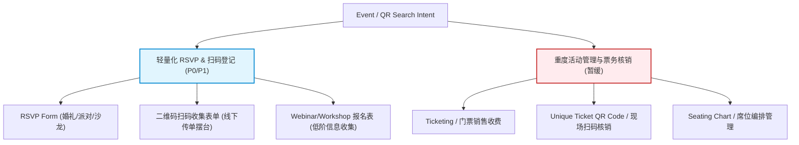

# GenForms.ai SEO Topic SERP 搜索意图研究报告 - 活动报名与 QR 扫码专题 (Event Registration & QR Event)

*   **分析周期**：2026年6月
*   **分析人**：Antigravity (AI Coding & Growth Assistant)
*   **对应 PRD V2.8 章节**：
    *   第 2.2 节（系统边界与 MVP 约束）：核对表单引擎功能
    *   第 3.1 节（AI 表单生成引擎）：一句话生成与 JSON Schema 转换
    *   第 4.3 节（多端分发与分享二维码）：二维码生成与分享路径
    *   第 6.1 节（集成接入与 Webhook 推送）：Feishu/Slack 推送与数据流向

---

## 1. 执行摘要 (Executive Summary)

活动报名（Event Registration）和 QR 扫码（QR Code Event）在 Google 搜索中拥有极高的检索量与明确的商业变现价值，但同时也面临着**功能范围（Feature Scope）的巨大分化**：
*   **重度活动管理平台（Event Management / Ticketing）**：如 Eventbrite、RSVPify、RegFox 等，主打门票销售、现场扫码核销、座位编排、多日程管理。这超出了 GenForms MVP 范围。
*   **轻量级活动报名与 RSVP（Lightweight RSVP & Sign-up）**：如 Microsoft Forms、Google Forms、rsvp.link、Canva 等，主打在线确认出席人数、饮食和时间偏好、快速生成分享二维码，并通过表格/Webhook收集数据。这与 GenForms MVP（AI 生成、单题流移动填写、Webhook 推送）高度契合。

### 核心结论与排期建议：
1.  **P0：RSVP Form** —— **立刻切入，重点打造。** 
    *   *论证*：用户意图极度倾向于“轻量、美观、快速填写”。GenForms 的单题流（Typeform-like）界面 and 高颜值毛玻璃主题是承接婚礼、沙龙、私人派对 RSVP 的绝佳载体。
2.  **P1：QR Code Event Registration Form** —— **特色功能，Landing 承接。**
    *   *论证*：大量用户在搜索“如何用二维码收集活动报名”。GenForms 应当在控制台和 Landing 页突出“扫码填写表单”能力（即直接为表单 URL 生成并展示美观的下载二维码），同时明确**不承诺**“门票扫码核销”。
3.  **P2：Workshop & Webinar Registration Form** —— **以模板库（Template Gallery）形式低成本覆盖。**
    *   *论证*：网络研讨会（Webinar）注册大量被 Zoom、Livestorm 等会议软件原生功能截流；工作坊（Workshop）通常需要复杂的课程表和支付。我们以表单模板形式覆盖即可，无需做专题 Landing。
4.  **红线（Redline）- 暂缓：支付、座位、门票核销。**
    *   *论证*：坚决不引入门票收费（Stripe/PayPal）、席位编排（Seating Chart）、日程表（Agenda Creator）以及核销 App（Check-in Scanner）。如果用户有此类需求，引导其通过 Webhook 对接到第三方系统（如 Zapier -> Eventbrite 或 Slack）。

---

## 2. 关键词 SERP 证据表 (Google US SERP Evidence Table)

以下数据基于美国区（Google US）实时自然搜索结果（去除了 Sponsored 广告，保留前 10 个核心结果）：

| 关键词 (Keyword) | 排名 | 页面标题 (Title) | 页面 URL (URL) | 页面类型 (Page Type) | 意图与竞品模式 (Intent & Pattern) |
| :--- | :--- | :--- | :--- | :--- | :--- |
| **event registration form** | 1 | Online Event Registration Form Template | [SurveyMonkey](https://www.surveymonkey.com/templates/event-registration-form-template/) | 模板页 (Template) | 收集基本信息，主打一键套用与自定义修改。 |
| | 2 | Event Registration | [Microsoft Forms](https://forms.office.com/Pages/DesignPageV2.aspx?templateID=TM11998125&omkt=en-us&Action=CreateByTemplate&tryout=true&linkorigin=OfficeTemplate) | 模板页 (Template) | 收集参会人数、物流和餐饮偏好，直接套用。 |
| | 3 | What to Include in an Event Registration Form | [Guidebook](https://www.guidebook.com/post/what-to-include-in-an-event-registration-form) | 教程 (Tutorial/Blog) | 解释必备字段：姓名、邮箱、门票类型、支付方式等。 |
| | 4 | 2800+ Event Registration Forms | [Jotform](https://www.jotform.com/form-templates/category/event-registration) | 模板分类页 (Category) | 庞大的行业细分模板库，提供拖拽编辑器。 |
| | 5 | The Ultimate Free Event Registration Form Template (+ Tips) | [Eventbrite](https://www.eventbrite.com/blog/event-registration-form-template-ds00/) | 行业博客 (Blog) | 介绍如何将表单与 Eventbrite 的售票和核销系统绑定。 |
| | 6 | Event Registration Form Template | [Zoho Forms](https://www.zoho.com/forms/templates/non-profits-forms/event-registration.html) | 模板页 (Template) | 面向企业，主打表单数据直接入库和 CRM。 |
| | 7 | How to Use Microsoft Forms for Event Registration | [Choose 2 Rent](https://choose2rent.com/blog/microsoft-forms-for-event-registration-guide/) | 设备服务商博客 (Blog) | 教用户如何用微软表单进行轻量级活动登记。 |
| | 8 | Registration Form Templates | [Cognito Forms](https://www.cognitoforms.com/templates/event-registration) | 模板页 (Template) | 提供支付和复杂逻辑的活动注册表单。 |
| **event registration form template** | 1 | Event Registration | [Microsoft Forms](https://forms.office.com/Pages/DesignPageV2.aspx?templateID=TM11998125&omkt=en-us&Action=CreateByTemplate&tryout=true&linkorigin=OfficeTemplate) | 模板页 (Template) | 快速启用 Office 套件中的活动登记页。 |
| | 2 | 2800+ Event Registration Forms | [Jotform](https://www.jotform.com/form-templates/category/event-registration) | 模板分类页 (Category) | 各种子行业模板，点击直接进入编辑器。 |
| | 3 | Online Event Registration Form Template | [SurveyMonkey](https://www.surveymonkey.com/templates/event-registration-form-template/) | 模板页 (Template) | 收集基本注册信息、出席天数与饮食要求。 |
| | 4 | The Ultimate Guide to Event Registration Forms | [Wiz Team](https://wiz-team.com/ultimate-guide-event-registration-forms/) | 专业工具博客 (Blog) | 专业活动管理软件的表单规范 and 字段指导。 |
| | 5 | How To Create Registration Forms (with 20+ Free Templates) | [SurveyMonkey](https://www.surveymonkey.com/learn/forms/online-registration-form-templates-surveymonkey/) | 教程页 (Tutorial) | 介绍如何建立包含 20 多个模板的线上报名流程。 |
| | 6 | Event Registration Form Template | [LimeSurvey](https://www.limesurvey.org/template/event-registration-form-template) | 模板页 (Template) | 开源问卷系统的活动登记模板。 |
| | 7 | Online Event Registration Form Template | [Typeform](https://www.typeform.com/templates/event-registration) | 模板页 (Template) | 极高颜值的单题流活动报名页，主打交互体验。 |
| | 8 | The Ultimate Free Event Registration Form Template (+ Tips) | [Eventbrite](https://www.eventbrite.com/blog/event-registration-form-template-ds00/) | 博客 (Blog) | 强调票务配置和现场扫码核销。 |
| **QR code event registration form** | 1 | Use QR codes for event registration, links to content | [Microsoft Dynamics 365](https://learn.microsoft.com/en-us/dynamics365/customer-insights/journeys/email-qr-code) | 产品文档 (Doc) | 教用户如何在确认邮件中生成“门票二维码”用于签到。 |
| | 2 | QR Codes for RSVP + Event Registration | [RSVPify](https://rsvpify.com/qr-code-rsvp/) | 工具落地页 (Tool Landing) | 核心概念：在传单/邀请函上印二维码 -> 扫码填写 RSVP -> 现场扫码核销。 |
| | 3 | Event QR Code for Event Marketing & Planning | [QR Code Generator](https://www.qr-code-generator.com/solutions/event-qr-code/) | 二维码工具 (Tool) | 静态/动态二维码工具，将扫描者引导至活动页面。 |
| | 4 | Event Registration Form Template with QR Code | [Form QR Code Generator](https://www.form-qr-code-generator.com/template/event-registration) | 模板页 (Template) | 自动将表单链接附带在二维码中生成的服务。 |
| | 5 | Event Registration: Generate QR Code for Faster Check-In | [Jotform](https://www.jotform.com/answers/37181101-event-registration-generate-qr-code-for-faster-check-in) | 用户社区 (Forum) | 用户提问如何实现在提交表单后向用户发送签到 QR 码。 |
| | 6 | How to Create a QR Code for an Event | [Choose 2 Rent](https://choose2rent.com/blog/how-to-create-a-qr-code-for-an-event/) | 设备商博客 (Blog) | 活动现场实体签到和徽章打印的二维码配置指南。 |
| | 7 | How to Create a QR Code for Microsoft Forms | [YouTube](https://www.youtube.com/watch?v=iGKfsOrhnH0) | 视频教程 (Forum) | 介绍如何将生成的表单链接转为二维码以便线下摆台扫码。 |
| | 8 | QR Codes for Event Registration | [RSVPify](https://rsvpify.com/qr-codes/) | 工具落地页 (Tool Landing) | 深入介绍扫码签到与无纸化签到的前台场景。 |
| **RSVP form** | 1 | How To Create RSVP Forms That Excite Your Guests | [SurveyMonkey](https://www.surveymonkey.com/learn/forms/rsvp-forms/) | 教程页 (Tutorial) | 介绍 RSVP 的必备信息（是否出席、随行人数、饮食偏好）。 |
| | 2 | 500+ RSVP Forms | [Jotform](https://www.jotform.com/form-templates/category/rsvp) | 模板分类页 (Category) | 包含婚礼、毕业派对、企业聚会等 RSVP 模板。 |
| | 3 | Create Beautiful RSVP Forms with a Short Link | [rsvp.link](https://rsvp.link/) | 微型工具 (Tool Landing) | **极简轻量级竞品**：主打极简创建、短链接分享、CSV导出，完全不带票务和核销。 |
| | 4 | RSVP Form Template - Free | [Typeform](https://www.typeform.com/templates/rsvp-form) | 模板页 (Template) | 主打高感官设计、动效丰富的交互式 RSVP。 |
| | 5 | Need help making RSVP Form | [Reddit r/GoogleForms](https://www.reddit.com/r/GoogleForms/comments/1hcpfrz/need_help_making_rsvp_form/) | 论坛 (Forum) | 用户求助如何实现选择不同人数时展示不同的后续字段。 |
| | 6 | Event Management Software for RSVP | [RSVPify](https://rsvpify.com/) | 工具落地页 (Tool Landing) | 为私人聚会和非正式活动提供快速 RSVP 收集器。 |
| | 7 | Free and customizable RSVP templates | [Canva](https://www.canva.com/templates/s/rsvp/) | 模板页 (Template) | 将电子请柬与 RSVP 表单二合一的高颜值页面。 |
| **webinar registration form** | 1 | Webinar Registration Forms | [LiveWebinar](https://www.livewebinar.com/features/webinar-promotion/registration-page) | 研讨会功能页 (Feature) | 网络会议系统的自带前置报名功能，直接生成参会链接。 |
| | 2 | Webinar Registration Form Template | [SurveyMonkey](https://www.surveymonkey.com/templates/webinar-registration-form-template/) | 模板页 (Template) | 通用网络研讨会报名模板，收集痛点、关注话题。 |
| | 3 | Scheduling a webinar with registration | [Zoom Support](https://support.zoom.com/hc/en/article?id=zm_kb&sysparm_article=KB0061631) | 官方文档 (Doc) | Zoom 研讨会自带报名功能配置说明。 |
| | 4 | Webinar Registration Form Template | [Fillout](https://www.fillout.com/templates/webinar-registration-form) | 模板页 (Template) | 新兴高阶表单工具的 Webinar 登记模板。 |
| | 5 | Webinar Registration Form Template | [Typeform](https://www.typeform.com/templates/webinar-registration-form-template) | 模板页 (Template) | 针对大厂 webinar 的体验式报名表。 |
| **workshop registration form** | 1 | Workshop Registration Form Template | [SurveyMonkey](https://www.surveymonkey.com/templates/workshop-registration-form-template/) | 模板页 (Template) | 收集工作坊参与者资料及期望收获。 |
| | 2 | Workshop Registration Form Template | [Jotform](https://www.jotform.com/form-templates/workshop-registration-form) | 模板页 (Template) | 包含课程选择、基本信息与免责同意书的表单。 |
| | 3 | How to create a workshop registration form | [forms.app](https://forms.app/en/blog/how-to-create-a-workshop-registration-form) | 博客教程 (Blog) | 介绍如何构建工作坊报名入口及设置名额限制。 |
| | 4 | Free Workshop Form Templates | [123FormBuilder](https://www.123formbuilder.com/free-form-templates/gallery-event-organizers/workshop-forms) | 模板分类页 (Category) | 活动组织者常用的工作坊表单组合。 |
| | 5 | Workshop Registration Form Template | [Paperform](https://paperform.co/templates/workshop-registration-form/) | 模板页 (Template) | 带图文混排和支付的工作坊注册页。 |

---

## 3. 搜索意图与产品契合度解剖 (Search Intent & Product Fit)

通过分析 SERP，我们将搜索意图解构为以下 5 种核心模式，并对齐 GenForms MVP 的能力边界：



### 3.1 RSVP Form（意图：轻量级出席确认）
*   **搜索意图**：偏向非正式活动（沙龙、婚礼、小型派对、团建、公司聚会）。用户关注的是“颜值”、“一键分享短链”、“自动统计人数与偏好（如饮食/是否携伴）”。
*   **GenForms MVP 契合度：极高 (P0)**。
    *   *为什么*：这类用户不需要昂贵的活动软件（如 Cvent 动辄数千美元，RSVPify 免费版限制多）。他们只需要一个美观的表单，能够在手机上流畅填写，并且通过 Webhook 把结果推送到 Slack/飞书或者直接下载 CSV。GenForms 目前的单题流体验和高颜值主题能降维打击普通的 Google Forms。

### 3.2 QR Code Event Registration Form（意图：线下扫码/确认凭证）
*   **搜索意图分化**：
    1.  *分部 A（扫码填写）*：主办方印制了纸质传单、海报，想让路人“扫码填写表单报名”。这是 **80% 中小组织者的真实需求**。
    2.  *分部 B（扫码核销）*：填完表单后，用户邮箱收到一个 PDF 门票（内含唯一二维码），门口保安拿着手机 App 进行扫码签到。这是 **重度活动策划者的需求**。
*   **GenForms MVP 契合度：中等 (P1，只做分部 A)**。
    *   *策略*：我们应当主打“一键生成分享二维码（Scan to Register）”。GenForms 可以在表单发布页提供一个极其精美、可自定义的二维码下载区（可带 Logo 和毛玻璃边框），作为重要的 Landing Page 卖点。同时，明确将“扫码核销”划为红线。

### 3.3 Webinar / Workshop Registration Form（意图：研讨会/工作坊报名）
*   **搜索意图**：收集参会人痛点、发送入会链接。
*   **GenForms MVP 契合度：中等 (P2)**。
    *   *为什么*：Webinar 通常已被 Zoom/Livestorm 的自带表单深度垄断（因为能自动同步发信和提醒）。但有部分 B2B 营销人员需要将线索收集到特定的 CRM（如 Webhook 推送至 Lark 自动审核）。我们只需要在模板库中增加 2-3 个精心设计的 Webinar/Workshop 模板（带“网络研讨会报名表”、“工作坊申请表”等标题），靠自然流量承接，无需单独为其开发高阶功能。

---

## 4. 竞品转化与承接路径分析 (Competitor Onboarding Paths)

我们对 SERP 上的头部竞品承接方式进行了还原，总结出三种典型路径：

### 模式 A：大而全的表单工具（以 Jotform, SurveyMonkey 为代表）
*   **落地页承接**：海量模板列表（`jotform.com/form-templates/category/rsvp`）。用户通过关键词筛选，看到密密麻麻的缩略图。
*   **转化漏斗**：
    1.  点击模板大图预览。
    2.  点击 **"Use Template"（使用此模板）** 按钮。
    3.  **强制弹窗注册/登录**（支持 Google/GitHub 一键登录）。
    4.  进入复杂的拖拽式表单编辑器（学习成本较高）。
*   **核心痛点**：对于普通用户（只是办个 30 人的团建或沙龙），Jotform 的编辑器过于沉重，手机端体验较差。

### 模式 B：高颜值交互式表单（以 Typeform 为代表）
*   **落地页承接**：美轮美奂的单题流动效展示，配合高清配图。
*   **转化漏斗**：
    1.  点击预览，直接在落地页免登录“试填”模板（能极大提升转化率）。
    2.  点击 **"Use this template"**。
    3.  引导注册/创建账户。
    4.  进入以“卡片单题流”为核心的轻量化编辑器。
*   **GenForms 借鉴点**：**“先试填，后注册”** 的漏斗设计。我们的 MVP 同样支持单题流预览，应该在 Landing 页提供直接的“免登录体验”交互。

### 模式 C：极简 RSVP 微型工具（以 rsvp.link 为代表）
*   **落地页承接**：极度干净的单页 Web 界面，没有任何复杂的多级菜单。
*   **转化漏斗**：
    1.  首页只有一个大大的输入框：`Create your RSVP link`。
    2.  输入活动名称，无需注册，直接在线勾选需要的字段（姓名、邮箱、加人限制、截止日期）。
    3.  点击 **"Publish"** 时，引导用户绑定邮箱（完成无感注册）。
    4.  立刻获得一个短链接（如 `rsvp.link/your-event`）。
    5.  后台仅提供一个列表，供下载 CSV 导出。
*   **GenForms 借鉴点**：这是最适合 GenForms 早期 MVP 的形态！**将“AI 表单生成”与“极简发布”结合，不需要让用户在创建之初去理解复杂的表单引擎。**

---

## 5. GenForms 能力与红线对比 (Capabilities vs. Redlines)

为了防止后续开发和 SEO 推广中产生过度承诺（Overselling），我们必须在报告中明确画出 MVP 功能的“绿线”与“红线”：

```
+-------------------------------------------------------------------+
|                           SYSTEM BOUNDARY                         |
+-------------------------------------------------------------------+
|  [可承诺的绿线能力 (MVP Scope)]                                      |
|  * AI 智能理解活动需求 (一句话生成 RSVP Schema)                      |
|  * 5 套高颜值毛玻璃/流光流动主题预览 (极速提升移动端填写转化率)       |
|  * 表单发布页一键生成"分享二维码" (可下载并印制海报)                   |
|  * 基础多分支跳转 (通过条件判断，不来的人自动跳过饮食偏好提问)        |
|  * 数据实时分发 (通过自定义 Webhook 或 Lark/Slack 机器人实时推送)    |
+-------------------------------------------------------------------+
|  [坚决不承诺的红线词 (Backlog / Out of Scope)]                      |
|  x 门票购买与在线支付 (Ticketing & Payment Portal)                |
|  x 独立门票二维码生成与门票核销 (Unique Ticket QR & Gate Scan App)   |
|  x 席位/座位图管理 (Seating Chart / Layout Editor)                 |
|  x 日程表与多会场选择器 (Multi-session Agenda / Multi-day Planner) |
|  x 内置邮件/短信群发与提醒系统 (Built-in Email Outbound Engine)     |
+-------------------------------------------------------------------+
```

---

## 6. Architect 阶段可行性论证与排期建议

### 6.1 论证结论：**适合进入 Architect 阶段（主打 RSVP / 轻量报名）**
我们明确支持 GenForms 针对该主题开展架构与页面设计，但定位必须是 **“AI 驱动的极速轻量 RSVP 表单生成器”**，而非“活动管理平台”。

### 6.2 建议的 Landing Page / 路由规划 (Routing Rules)
对于 SEO，我们应该在 Next.js 工程的 `Code/app/[locale]/(default)/templates/` 下建立对应的模版或子路由：
1.  **`/templates/rsvp-form`**：承接 `RSVP form` / `free rsvp form template` 流量。
2.  **`/templates/event-registration`**：承接 `event registration form` / `online event registration form` 流量。

*注：根据 `AGENTS.md` 安全原则，所有这些页面的 Breadcrumbs（面包屑导航）必须使用绝对 URL，以防止 GSC（Google Search Console）再次出现 "字段名称: 不适用 (id 缺失)" 的校验报错。*

### 6.3 模版元数据（Prisma / JSON Schema 规划）
我们建议在 `Code/services/form-templates.ts` 中增加或精简活动相关的场景模版。例如，为 `event-registration`（已存在）模版调整 Quick Actions：
*   **增加针对 RSVP 场景 of AI 快捷指令**：
    *   *中文*：`"改为婚礼 RSVP 邀请表"`、`"加一个携带随行家属人数限制"`、`"生成报名成功后的飞书推送文案"`。
    *   *英文*：`"Convert to Wedding RSVP"`, `"Add a plus-one limit field"`, `"Setup Feishu notification on submission"`.

---

## 7. 下一步行动清单 (Next Actions Checklist)

- [ ] **GSC 面包屑补丁部署**：优先完成上个周期的 GSC 报错修复（对 5 个动态路由面包屑补齐 `@id` 绝对路径参数）。
- [ ] **模版元数据扩充**：在 `Code/services/form-templates.ts` 中升级已有的 `event-registration` 字段逻辑，并新增一个极简的 `rsvp-form` 模版。
- [ ] **SEO Landing Page 编写**：由 Codex 或 Workbuddy 编写对应的前端静态落地页，确保元数据（Title/Description/Schema）完美覆盖 Google 搜索词。
- [ ] **二维码分享功能微调**：检查控制台表单发布区，确保“生成表单二维码并支持一键下载”这一闭环功能在前端正常工作（这是承接线下扫码报名的核心实体凭证）。
