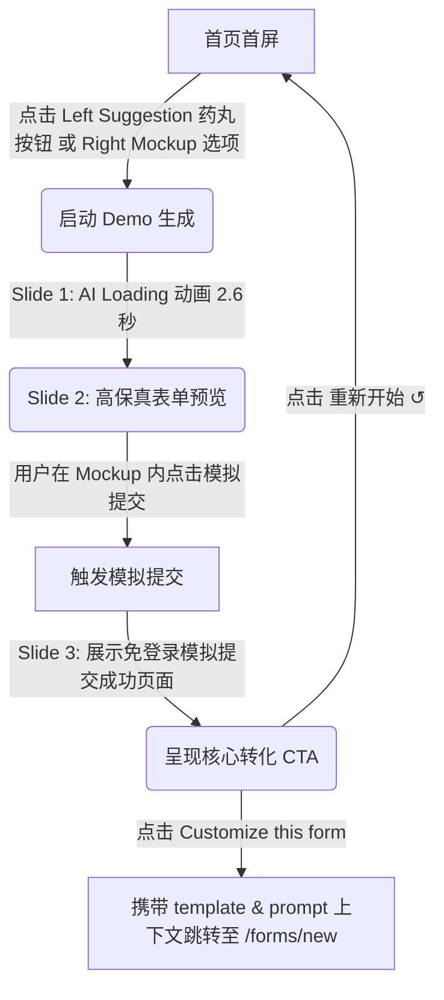

# GenForms.ai 产品体验与激活优化实施方案 (Implementation Plan)

> 版本：2026-06-11 (返工收敛版 V2)
> 目标：精简首页体验路径，消除游客冷启动阻力，规范事件追踪，确保双端体验一致，只推进高保真精简 Demo。

---

## 任务一：首页 Prompt 区域前置高频免输入场景 Demo (精简版)

### 1. 目标漏斗节点
* 激活游客最上游节点：
  $$\text{page\_view} \rightarrow \text{demo\_start} \rightarrow \text{demo\_complete}$$
* 引导进入中游模板套用阶段：
  $$\text{demo\_complete} \rightarrow \text{template\_use\_click}$$

### 2. 需要读取的代码文件
* [Code/components/blocks/hero/index.tsx](file:///Users/mike/Documents/AIFactory/Code/components/blocks/hero/index.tsx) (首页 Hero 组件)
* [Code/services/form-templates.ts](file:///Users/mike/Documents/AIFactory/Code/services/form-templates.ts) (场景模板定义)
* [Code/components/forms/form-preview-panel.tsx](file:///Users/mike/Documents/AIFactory/Code/components/forms/form-preview-panel.tsx) (表单预览核心组件)

### 3. 预计需要修改的文件
* [Code/components/blocks/hero/index.tsx](file:///Users/mike/Documents/AIFactory/Code/components/blocks/hero/index.tsx)

### 4. UI / 交互流程设计



#### A. 开始触发 (Start)
* 首页左侧 Prompt 输入框下方提供 3 个核心场景药丸按钮（点击直接控制右侧 Mockup，**不再立即跳转页面**）：
  1. `🎟️ 科技峰会门票` (对应模板：`event-registration` / `event-booking`)
  2. `🚀 SaaS 潜客收集` (对应模板：`lead-capture` / `saas-lead-capture`)
  3. `📈 客户满意度调查` (对应模板：`satisfaction-survey` / `customer-feedback`)
* 首页右侧 Mockup 的 Slide 0 保留原有的 3 个目标选择。用户点击任意药丸或 Mockup 中的选项，都将触发 Demo 状态。

#### B. AI 模拟生成 (Loading)
* Mockup 平滑切换到 **Slide 1 (模拟生成)**。
* 显示加载圈，并在 2.6 秒内依次动态显示任务日志动画：
  * `⚡ AI 正在自动生成字段与文案...`
  * `🎨 主题样式与交互动效已就绪...`
  * `🚀 部署通道与 Webhook 模拟准备完毕...`

#### C. 高保真表单预览 (High-Fidelity Preview)
* 模拟加载完成后，Mockup 切换到 **Slide 2 (表单预览)**。
* **极简交互方案**：不要做 3 题完整填写、电子胸牌、条形码等复杂交互与 Gratification。直接在 Mockup 内展示所选模板的高保真预览。
* **禁止 PII 敏感信息收集**：
  * 首页游客 Demo 禁止提供可打字输入手机号、邮箱等敏感隐私信息的输入框。
  * 用户可以免输入，界面只提供：
    1. 预填好的非敏感示例数据（例如姓名显示为 `Mike` 等占位符/模拟输入效果）；
    2. 简单的选择题点击；
    3. 完全免输入（仅作为展示），只包含一个高亮按钮提示“确认提交并体验”。
  * 提供一个显著的模拟“提交表单”或“完成模拟”按钮，用户只需点击一次即可完成，平滑进入 Slide 3。

#### D. 模拟完成与转化 (Simulation Complete & Conversion)
* 用户在 Slide 2 点击提交按钮后，Mockup 切换到 **Slide 3 (模拟提交成功与 CTA)**。
* 显示简洁的成功提示：`🎉 模拟提交成功！数据未写入真实数据库。`
* 呈现转化按钮：
  * **主 CTA (Customize this form)**：点击后跳转至 `/${locale}/forms/new?template=...&prompt=...`
  * **次级链接 (重新开始 ↺)**：点击返回 Slide 0 初始状态。

### 5. 埋点与事件修正

* **场景启动**：点击左侧 Suggestion 药丸按钮或 Mockup 选项时触发：
  `trackGrowthEvent("demo_started", { option: templateId, entry_point: "homepage_suggestions" | "homepage_hero_mockup" })`
  *(映射为 GA4: `demo_start`)*
* **模拟提交完成**：在 Slide 2 点击“提交”或“模拟完成”时触发：
  `trackGrowthEvent("demo_completed", { option: templateId, entry_point: "homepage_hero_mockup" })`
  *(映射为 GA4: `demo_complete`)*
* **点击去自定义 (Customize this form)**：
  * **【硬性规定】点击 "Customize this form" 绝对禁止记录为 \`ai_generate_submitted\` 或 \`form_generate\`**，因为此时尚未发生真实的 AI 生成动作。
  * 必须记录为：
    `trackGrowthEvent("template_used", { template_id: templateId, source: "homepage_demo_completed", entry_point: "homepage_hero_mockup" })`
    *(映射为 GA4: \`template_use_click\`)*
  * **真实生成埋点限制**：\`form_generate\` 必须在用户跳转进入 \`/forms/new\` 后，并发生真实的 AI 生成动作（例如点击输入框旁的“生成”按钮）时才被允许触发。

### 6. 移动端注意事项
* 手机端用户点击左侧 Suggestions 药丸时，页面应通过 `window.scrollTo` 平滑滚动到下方 Mockup 容器，防止用户漏看 Mockup 状态的变化。

---

## 任务二：/forms/new 消费参数验证与小修补计划

由于 `FormGenerator` 当前已经能够自动提取并在挂载时解析 template/prompt 参数，且 `initialTemplateId` 会自动触发 `handleApplyTemplate` 并置 `mobileTab` 为 `"preview"`。因此，本任务不再进行任何从零的业务开发，而是定位为**集成验证与小修补**，确保游客体验链路的通畅。

### 1. 目标漏斗节点
* 服务于创建页的初次价值确认：
  $$\text{template\_use\_click} \rightarrow \text{form\_generate}$$

### 2. 需要读取的代码文件
* [Code/components/forms/form-generator.tsx](file:///Users/mike/Documents/AIFactory/Code/components/forms/form-generator.tsx) (创建工作台)
* [Code/components/forms/form-creation-manager.tsx](file:///Users/mike/Documents/AIFactory/Code/components/forms/form-creation-manager.tsx) (保存/发布校验)

### 3. 预计需要修改的文件
* 如有必要，进行少量参数传递与界面默认状态的微调修正（如验证中发现 Bug）。

### 4. 验证与检查矩阵

| 检查维度 | 预期正确行为 (SOP) | 验证手段 | 失败修补策略 |
| :--- | :--- | :--- | :--- |
| **入口参数完整性** | 从首页 (Hero Demo)、模板页、Solution 页面以及博客页面跳转到新版表单页时，链接必须完整携带 `template=xxx` 和 `prompt=xxx` 查询参数。 | 逐个点击各个场景与链接跳转，观察浏览器 URL 是否包含对应的 query strings。 | 检查并修改各处 Link (如 `Solution` 中的 CTA，`Blog` 中的表单推荐链接) 的参数拼接逻辑。 |
| **游客预览可用性** | 游客在未登录状态下进入 `/forms/new?template=xxx` 时，页面能够流畅加载，**绝对不能**弹出登录拦截弹窗；右侧沙盒 (Sandbox) 应即时将所选模板解析并渲染出高保真表单预览。 | 清除浏览器 Cookie，匿名模式访问 `/forms/new?template=lead-capture`。 | 排查挂载与 API 初始化逻辑，确保 template 预览数据不依赖当前 Session 状态，阻止鉴权 Modal 提前弹出。 |
| **移动端 Preview 默认** | 在移动端设备（或 Chrome DevTools 移动端调试模式）下，带参数加载表单创建页，页面默认展示的选项卡应为 `"preview"`（预览图），而非表单编辑或设置。 | 移动端分辨率下访问 `/forms/new?template=lead-capture`，观察默认渲染视图。 | 确保 `FormGenerator` 中的 `handleApplyTemplate` 执行了 `setMobileTab("preview")`。 |
| **敏感动作登录拦截** | 游客可以在沙盒中修改配置、体验预览；但当点击左侧的“生成/微调”按钮，或者右上角的“保存草稿”及“发布表单”等需要写 DB 或调用 API 费用的敏感操作时，页面应当被强制登录拦截遮罩阻断。 | 游客状态下操作“保存”或“重新生成”，观察是否弹出登录弹窗且操作被拦截。 | 确认 `handleGenerate` 以及保存/发布逻辑中，若 `isGuest === true` 则立即调用 `setShowSignModal(true)` 进行拦截。 |

---

## 验证计划 (Verification Plan)

### 自动化测试
* 运行现有测试用例：
  ```bash
  npm run test
  ```
  *(注：如果需要，可以为埋点行为和 query 校验编写单元测试)*

### 手动验证步骤
1. 打开无痕浏览器窗口访问首页，点击 Prompt 输入框下方的药丸按钮，确认 Mockup 立即播放 2.6秒 loading。
2. 观察 Slide 2 出现的表单预览：检查是否不包含可以打字输入的敏感 PII 字段，点击提交后无痕过渡到 Slide 3。
3. 检查控制台 Growth Events 打印，或者在 NetWork 确认：
   * 点击选项触发 `demo_started`
   * 点击模拟提交触发 `demo_completed`
   * 点击 Customize this form 触发 `template_used` (而非 `form_generate` 或 `ai_generate_submitted`)
4. 点击 Customize this form，跳转至 `/forms/new`，确认地址栏携带正确参数，右侧 Sandbox 成功绘制预览。
5. 尝试在 `/forms/new` 以游客身份修改主题颜色，预览应实时生效。点击左侧“生成”或右上角“发布”，应立刻弹出登录弹窗且操作无效。
