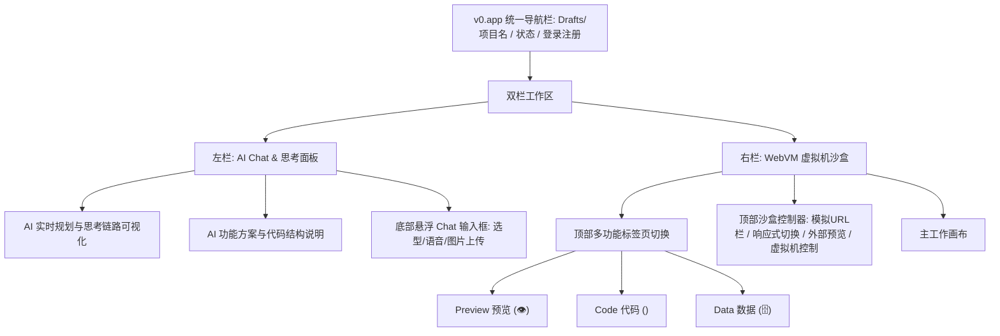

# v0.app 竞品深度分析与学习报告

## 一、 产品概述与定位

`v0.app`（前身为 `v0.dev`）是 Vercel 推出的 AI 驱动型前端界面与全栈应用生成平台。它能够将用户的自然语言 Prompt 或上传的视觉草图（图片、Figma）直接转化为高质量、生产就绪的 React / Next.js 代码，并搭载了完整的基于 Web 虚拟机的实时沙盒预览系统。

### 🧠 产品本质模型
输入（Prompt / 图片 / Figma） → AI 规划与代码流式生成 → WebVM 沙盒热编译 → 实时交互预览 & 双向改码 → 部署/代码导出

### 🎯 平台定位与设计哲学
v0.app 的定位不仅是一个“代码生成器”，而是一个**“AI 交互式协同设计师与开发沙盒”**。它遵循“首版即草稿，通过迭代臻于完美”的渐进式设计哲学，将 AI 对话与实时沙盒环境无缝融为一体。

---

## 二、 界面布局架构分析

v0.app 界面采用了极具专业感的“双栏/多面板”视窗布局，极大优化了屏幕利用率，并为开发者提供了极其逼真的 IDE 与预览环境：



### 1. 左侧栏：AI Chat & 思考中心 (Width: 35%)
* **思考链路可视化**：当 AI 运行时，它会流式展示其思考和步骤规划（如：`Thought for 2s`, `Exploring 2 files`, `Installing dependencies`）。
* **中文详解对话**：AI 用优雅清晰的 Markdown 阐述其设计选型、核心功能以及代码组织逻辑（例如解释它如何构建了三步签到流表单、采用了何种动画实现）。
* **智能输入底栏**：
  * 支持多行文本的富文本输入。
  * **模型选择器**（如 `v0 Max`）允许在不同算力和专长模型间切换。
  * **媒体添加**：支持麦克风语音输入及图片/草图上传（这与我们 MVP 中计划的 OCR/图片去重/图片转表单逻辑高度共鸣）。
  * 贴心的时间反馈：“Worked for 1m 43s”，向用户明确展示 AI 为此付出的劳动。

### 2. 右侧栏：WebVM 虚拟机沙盒 (Width: 65%)
* **多视图无缝切换**：通过最左上角的极简图标，快速切换三种视图：
  * 👁️ **Preview (实时预览)**：在完整的浏览器沙盒内交互、测试页面。
  * `</>` **Code (源码查看)**：查看完整的 React 源码和工程目录。
  * 🗄️ **Data (数据视窗)**：观测页面状态及表单收集的结构化 JSON 数据。
* **高拟真浏览器控制台**：
  * 顶部提供虚拟的 Mock 浏览器地址栏（如 `localhost:3000/`），支持后退、前进、刷新。
  * **多端响应式切换**：一键在 Desktop (桌面端) 和 Mobile (移动端) 视图尺寸间切换，方便测试表单在不同设备上的自适应表现。
  * 外部独立预览按钮（在新标签页中全屏打开）与 VM 控制台日志抽屉（Show Console）。
* **三栏式交互代码编辑器 (IDE)**：
  * **文件树管理器**：展示完整的 Next.js 结构，支持用户自主新建文件/文件夹、刷新和清理。
  * **主编辑区**：配备完整的 VS Code 代码高亮、多标签页（Tabs）、面包屑导航、行号、以及**右侧代码缩略图 (Minimap)**，极具极客范。

---

## 三、 表单生成过程与交互体验（以会议签到表为例）

我们以 **“Create a conference check-in form” (创建会议签到表)** 为 Prompt 在沙盒中进行了全流程生成与运行测试，发现其生成的表单在“美学设计”、“多步流转”和“交互反馈”上达到极高水准：

### 1. 渐进式多步骤表单流 (Step Wizard UX)
为了降低长表单的填写流失率，v0 默认生成了设计感极强的**三步渐进式表单**（类似 Typeform 单题流思想，但更加紧凑）：
* **第一步：参会者信息 (Attendee Info)** —— 名字、姓氏、电子邮箱、公司名称，并提供优雅的下拉选择框 (Select) 让用户选择“职位 (Role)”。
* **第二步：参会证设置 (Badge Settings)** —— 输入显示姓名，并利用单选组 (Radio Group) 水平排布选择“饮食需求（无特殊要求、素食、纯素、清真、无麸质）”。
* **第三步：分会场选择 (Session Selection)** —— 多选框 (Checkbox) 列表选择感兴趣的学术/技术会场（如 AI 与机器学习、现代 Web 开发等），并勾选“是否愿意参加社交活动”。

### 2. 状态机驱动的流畅过渡动画
v0 生成的代码中，通过 React 状态机与 Tailwind CSS 的过渡属性（Transition）完美结合：
* 状态定义：`const [step, setStep] = useState(1)`
* 步骤容器动画：
  ```tsx
  <div className={`transition-all duration-300 ${
    currentStep === 1 ? 'opacity-100 translate-y-0 scale-100' : 'opacity-0 pointer-events-none absolute'
  }`}>
     {/* 第一步表单字段 */}
  </div>
  ```
  在填表过程中点击“下一步”时，当前表单会顺滑地向上淡出，下一步表单则伴随轻微的弹簧反馈向上淡入，提供了极佳的动效高级感。

### 3. 前端实时字段校验 (Validation)
每个步骤的“下一步”按钮都被状态绑定。AI 编写了严格的前端逻辑：
* 如果第一步的 `Email` 格式不合规（如缺失 `@`）或必填项为空，右下角的按钮将保持 `disabled` 状态，或在输入框下方标红显示微提示（Micro-copy），极大保证了收集数据的质量。

### 4. 惊喜性终态展示 (Badge Success Card)
传统表单在提交后往往只显示一句简陋的“提交成功”。而 v0 生成的表单在用户点击“完成签到”后，展示了极具视觉冲击力的**交互式电子参会证卡片 (Visual Badge)**：
* 卡片采用渐变拟物设计，清晰印着参会者的姓名、公司名称，并自动生成了模拟的 **条形码 / QR Code**。
* 提示文字告知：“参会证已发送至您的邮箱：mike@example.com”。这种“即时奖励机制”给用户带来了强烈成就感，极高地提升了用户体验。

---

## 四、 生成结果的技术架构深度解析

分析 v0.app 生成的 Next.js 工程，其技术栈和模块分层非常严谨，十分值得我们在设计 GenUI 表单时进行标准化：

### 1. 技术栈选型
* **框架**：Next.js 15 (App Router, Client Components 混合)
* **样式**：Tailwind CSS (利用 `globals.css` 集中定义 HSL 配色变量)
* **组件库**：**shadcn/ui** (基于 Radix UI 的无样式无头组件) + **Lucide React** 图标库
* **主题化支持**：采用 `next-themes` 和 `components/theme-provider.tsx` 实现原生深浅色一键平滑切换。

### 2. 核心文件架构
```
V0-PROJECT/
├── app/
│   ├── globals.css         # 全局样式，包含 HSL 柔和调色板与全局深色主题变量
│   ├── layout.tsx          # 根布局，提供全局字体与多语言 HTML 头
│   └── page.tsx            # 应用入口，加载 CheckInForm 主组件，并处理背景渐变
├── components/
│   ├── check-in-form.tsx   # 【核心业务组件】封装了 Step 1-3 状态机、校验、提交与 Badge 卡片渲染
│   ├── theme-provider.tsx  # 主题上下文组件
│   └── ui/                 # 自动下载的原子组件，利用 Tailwind 细粒度修改
│       ├── button.tsx
│       ├── checkbox.tsx
│       ├── input.tsx
│       ├── label.tsx
│       ├── radio-group.tsx
│       └── select.tsx
├── package.json            # 依赖声明 (radix-ui, lucide-react, clsx, tailwind-merge)
└── tsconfig.json           # 严格模式 TypeScript 配置
```

---

## 五、 模板系统与复用机制分析

`v0.app` 的模板系统采用“开箱即用，社区共建，一键克隆”的生态化打法：

1. **Suggesion 导流气泡**：在搜索栏下方常驻 `Contact Form`、`Mini Game` 等快速推荐胶囊，降低了用户首次输入的思考难度。
2. **多品类分类模板推荐**：首页直接划分 `Apps and Games` (应用与游戏)、`Landing Pages` (落地页)、`Components` (UI组件)、`Dashboards` (后台面板)。用户可以直接点击喜欢的模板，一键进入沙盒进行克隆。
3. **“克隆与二次创作 (Fork & Remix)”**：
   - 每一个用户在 v0.app 生成的页面只要设为公开，就自动变成社区模板。
   - 其他用户可以直接浏览该页面的所有 Prompt 历史、历史生成的版本（Version 1, Version 2, ...），并能一键点击“Add to project”或“Remix”在当前沙盒中进行增量修改。
   - 这不仅是一个极佳的展示橱窗，也是平台极强的社交传播机制。

---

## 六、 对我们 AI Form Factory MVP 建设的核心借鉴与行动方案

结合我们目前“AI 表单生成与数据收集系统（PRD V1.1 MVP 阶段）”的定位，v0.app 在**生成链路**和**产品体验**上为我们提供了非常明确的对齐和提升方向：

### 🚀 借鉴行动点 1：控制台与生成界面改版 (Layout Optimization)
* **现状痛点**：目前我们的生成页面 `FormGenerator-AgentMode.html` 虽然效果很好，但在 AI 交互生成过程的直观感上还有提升空间。
* **改进方案**：
  * **引入 v0 标志性的“左聊右看”双栏布局**。左边为 AI 智能助理控制台，流式输出生成计划并接收修改指示；右边为带有 Mock 浏览器外壳的 Iframe 沙盒，渲染生成的表单。
  * **增设 Code 与 Preview 标签切换器**。允许用户一键切换到 Code 视图，查看 AI 正在生成的 JSON Schema 和 React 代码，建立“开发掌控感”。

### ⚡ 借鉴行动点 2：AI 生成流程可视化 (Reasoning Process & State)
* **改进方案**：
  * 引入 **“AI 思考状态轴 (Thinking Chain)”**，在表单生成的几十秒内，不使用单一的 Loading 菊花图，而是流式打字输出 AI 正在做的事情（例如：`正在解析表单需求...` -> `正在生成表单 Schema...` -> `正在优化表单主题配色...` -> `正在注入校验规则...` -> `构建成功！`）。这不仅极大地增强了趣味性，也平抚了用户等待 LLM 响应时的焦虑。

### 🎨 借鉴行动点 3：多步骤单题流 (Step Wizard & Dynamic Validation)
* **改进方案**：
  * 在表单模板库中，**加入“渐进式分步表单 (Typeform/v0 Style)”的高级模板**。AI 生成表单时，除了输出普通的单页长表单，还会根据提示词智能生成分步式表单 Schema（带有多步切换状态机和流畅的前端校验）。
  * 强化提交校验，将 input 组件状态与下一步按钮可用性深度联动。

### 🎁 借鉴行动点 4：增强的表单终态设计 (Gratification & Badging)
* **改进方案**：
  * 传统的提交成功界面极易让人产生枯燥感。我们的表单引擎可以在 Schema 中增设一个 `successTemplate` 字段。
  * AI 在生成会议签到、活动报名、优惠券发放等表单时，**自动为其生成精美的参会证卡片 (Badge)、专属门票 (Ticket) 或优惠券卡片**。卡片上自动读取前面表单输入的名字、公司、等级，并附带一个动态条形码/二维码，大大提升表单的完成价值，给用户极高的高级感反馈。

### 🌐 借鉴行动点 5：模板生态建设 (Template Catalog & Suggestions)
* **改进方案**：
  * 在我们 MVP 平台的首页，借鉴其 Suggestion chips，在 AI 输入框下方放上 `会议签到表` , `极简意见反馈表` , `员工周报收集表` 等精美预制卡片，用户点一下就能自动填充输入框并提交 AI 生成，极大降低上手门槛。
