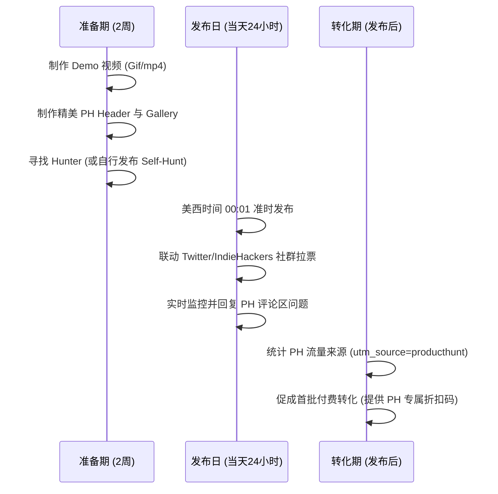

# GenForms.ai (AI FormFactory) 全球冷启动与海外流量获取执行计划

既然我们的目标客户聚焦于**国际市场**，我们将所有的精力和资源集中在海外开发者、独立黑客、中小企业和无代码爱好者的核心聚集地。

以下是专为 `genforms.ai` 量身定制的全球冷启动执行指南，分为三个核心阶段：**导航目录收录**、**社区互动曝光** 以及 **ProductHunt 爆破发布**。

---

## 阶段一：高权重 AI 导航与替代品目录提交 (3-5 天内完成)

这些目录不仅是海外用户寻找工具的首选，更是建立 **Domain Authority (域名权重)** 的高价值外链来源。请使用 [traffic_growth_kickoff_toolkit.md](file:///Users/mike/Documents/AIFactory/ProjectDocs/Operations/traffic_growth_kickoff_toolkit.md) 中的英文物料进行提交。

| 平台名称 | URL | 提交策略与权重作用 |
| :--- | :--- | :--- |
| **AlternativeTo** | `https://alternativeto.net/` | **极度优先**。用户搜索 "Typeform Alternative" 或 "Jotform Alternative" 时的第一落脚点。前往该平台创建 GenForms 词条，打上 `Typeform Alternative` 标签，并邀请朋友进行点赞（Upvote）。 |
| **There's An AI For That** | `https://thereisanaiforthat.com/` | 全球最大的 AI 工具站，每日 IP 极高。免费提交排队较慢，如果预算允许，可以考虑其付费快速收录（约 $29-$49），能直接带来第一波种子流量。 |
| **Toolify** | `https://www.toolify.ai/` | 自动抓取和收录，但手动提交能确保分类的精准性（AI Form Generator / Form Builder）。 |
| **Futurepedia** | `https://www.futurepedia.io/` | 极高权重的 AI 目录，吸引大量寻找提效工具的白领和运营人员。 |
| **SaaSHub** | `https://www.saashub.com/` | 专注于 SaaS 工具对比的平台，有助于提升域名 DA 权重。 |

---

## 阶段二：Reddit 与 HackerNews 社群冷启动 (第 1 - 2 周)

海外社区极度排斥“硬广告”，发布时必须以 **“Build in Public (公开创业)”** 或 **“Providing Value (解决痛点)”** 的视角进行。

### 1. Reddit 营销策略
*   **推荐 Subreddits**:
    *   `r/sideproject` (15M+ 成员，展示个人项目的首选)
    *   `r/nocode` (寻找无代码表单的精准受众)
    *   `r/SaaS` (讨论产品架构、商业模式与平替定价)
    *   `r/indiehackers` (独立黑客交流地)
*   **发帖黄金法则**:
    *   **讲故事**：说明“为什么开发它”（例如：被 Typeform 昂贵的订阅费恶心到了，想为社区做一个高颜值、支持 Webhook 且价格合理的平替）。
    *   **征求反馈 (Ask for feedback)**：在帖子末尾询问："What themes are we missing?" 或 "How is the loading speed in your region?"。
    *   **及时回帖**：保持前 24 小时活跃，认真回复每一个评论。Reddit 算法会根据互动率将帖子推上 Hot 榜单。

### 2. HackerNews "Show HN" 规则
*   **标题格式**: `Show HN: GenForms – AI-powered step-by-step form builder`
*   **发布时间**: 选在北美时间（PST）早上 6:00 - 8:00（即北京时间晚上 21:00 - 23:00），此时北美用户刚起床，HackerNews 流量正值高峰。
*   **首层评论 (Introductory Comment)**:
    *   发布后，立即自己写一条详细的回复，阐述技术栈（Next.js 15 Standalone, Supabase, Prisma, DeepSeek API），解释背后的逻辑架构，以及未来开源或演进的计划。HackerNews 的读者非常看重技术细节和极客精神。

---

## 阶段三：ProductHunt 平台爆破发布 (第 4 周左右)

ProductHunt (PH) 是全球科技新品发布的终极战场，一次成功的 PH Launch 可以为网站带来数万级独立 IP 访问和数千个注册用户。

### 1. 发布准备清单
*   **PH Gallery Images (1:1 或 16:9)**: 至少 4 张展示图，第一张必须是动态 GIF（例如展示一句话生成表单的魔法瞬间，非常吸睛）。
*   **PH Banner (800x450)**: 动态 Banner 能够显著提高点击率。
*   **Demo 视频**: 1-2 分钟的 Youtube 视频，展示生成、填写、Webhook 接收数据的全流程。
*   **PH 优惠代码**: 准备一个专属折扣码（如 `PRODUCTHUNT20`，付费计划首月 8 折），放在 PH Landing Page 顶部，用于承接 PH 流量并刺激转化。

### 2. 发布日执行表 (美西时间凌晨 00:01 准时发布)
*   **前 2 小时**：利用我们积累的种子用户，在 Twitter (X)、IndieHackers 上同步发帖：“*We are live on Product Hunt! We'd love to hear your feedback.*”
*   **拉票限制**：Product Hunt 严禁“买票”或直接要求别人“Upvote”。应该使用“Check us out on Product Hunt and leave your feedback”这类中性引导。
*   **争取 Featured 榜单**：前几个小时的自然点赞和评论数量决定了产品能否进入当日 PH Top 榜单。如果冲进前五名，PH 会在次日的全球邮件周报中进行推荐，流量呈指数级增加。

---

## 阶段四：被动流量与长期流量追踪 (Attribution Verification)

随着我们在 AlternativeTo、Reddit 和 ProductHunt 发布链接，我们的流量分析后台已经完全做好了渠道归因准备。

1. **自动提取 utm_source**：
   * 所有通过 PH 访问的链接（如 `https://genforms.ai/?utm_source=producthunt`）会被客户端自动提取。
   * 用户如果通过 Reddit 的外链访问，`GrowthTracker` 会自动把 `document.referrer` 解析为 `reddit.com` 并记录。
2. **在后台查看统计**：
   * 登录您的管理员后台：`https://genforms.ai/admin/growth`。
   * **流量渠道 (Traffic Sources)** 模块将实时以列表形式展示各个海外渠道（如 `producthunt`, `reddit.com`, `alternativeto.net`, `twitter.com`）带来的独立 IP 数与注册用户占比，帮助您直观判断哪种渠道效果最佳。
