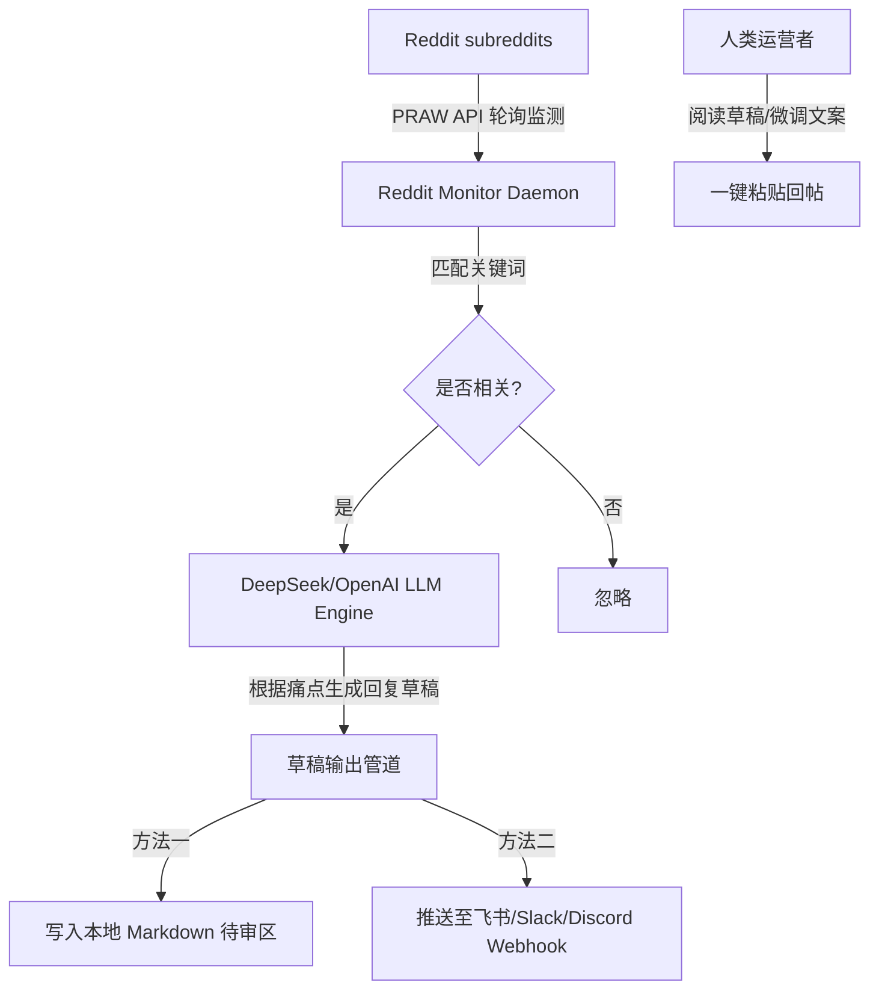

# Reddit 推广监测与 AI 智能回复草稿 Agent 方案设计

本方案旨在为 `genforms.ai` 建立一套**海外社交媒体舆情监控与半自动引流飞轮**。
通过轻量级的 Python 脚本监测 Reddit 热门板块，利用 LLM (DeepSeek) 针对用户痛点定制生成专业的、利他的回帖草稿，帮助人类在最少的时间内产出高质量的社区互动，从而获取精准的早期海外客户。

---

## 一、 系统架构设计



### 1. 监测板块 (Subreddits)
*   `r/sideproject`：独立创客项目展示，对平替产品包容度最高。
*   `r/nocode`：寻找低代码/无代码工具的精准受众。
*   `r/SaaS`：经常有讨论 Typeform 涨价和 SaaS 选择的帖子。
*   `r/webdev` / `r/reactjs`：讨论表单收集、数据校验技术的板块。

### 2. 监测关键词 (Keywords)
*   `typeform` (包括 `typeform alternative`, `expensive typeform`, `typeform limit`)
*   `form builder` (包括 `interactive form`, `step-by-step form`, `conversational form`)
*   `jotform` / `survey monkey` (竞品平替词)

### 3. AI 提示词与回复原则 (Strict Prompting Rules)
为了不被 Reddit 版主封号，AI 生成的回复必须遵循以下规则：
*   **利他优先 (Be Helpful First)**：先正面回答对方的问题，提供真正有价值的建议或方案，禁止一上来就贴链接。
*   **诚实声明 (Disclaim Connection)**：明确声明自己是该项目的开发者 (e.g. *"Full disclosure: I'm the creator of GenForms..."*)。在 Reddit，诚实的态度能获得极高好感，而伪装成路人推荐则会被瞬间举报。
*   **痛点匹配**：如果对方抱怨 Typeform 贵，AI 就强调 GenForms 的免费额度与合理定价；如果对方抱怨功能少，AI 就强调支持 Webhook 详细日志和 DeepSeek 智能填单。

---

## 二、 部署与运行环境准备

### 1. 申请 Reddit API 凭证 (1分钟)
1. 登录您的 Reddit 账号。
2. 访问 [Reddit App Preferences](https://www.reddit.com/prefs/apps)。
3. 点击 **"create another app..."** 按钮。
4. 填写以下信息：
   * **name**: `GenFormsMonitor`
   * **App type**: 选择 **script** (极其重要，用于本地运行)
   * **description**: `A script to monitor form builder discussions`
   * **about url** & **redirect uri**: 填 `http://localhost:8080` 即可
5. 点击 **create app**，您将获得：
   * **Client ID** (在 "personal use script" 下方的一串 14 位字符)
   * **Client Secret** (显示为 "secret" 后面的一串字符)

### 2. 补充配置至环境变量
在 `.env.local` 中补充以下密钥配置（禁止硬编码入代码）：
```env
REDDIT_CLIENT_ID="您的_Client_ID"
REDDIT_CLIENT_SECRET="您的_Client_Secret"
REDDIT_USER_AGENT="mac:genforms-monitor:v1.0 (by /u/您的Reddit用户名)"
DEEPSEEK_API_KEY="您的_DeepSeek_Key"
# 可选：配置推送通知 Webhook
# NOTIFICATION_WEBHOOK_URL="https://open.feishu.cn/open-apis/bot/v2/hook/..."
```

---

## 三、 脚本核心代码实现草案

脚本将以独立服务或后台任务形式运行。我们在本地创建核心实现逻辑 `scripts/reddit_promoter_agent.py`：

```python
import os
import time
import praw
from openai import OpenAI
from dotenv import load_dotenv

# 加载配置
load_dotenv('.env.local')

# 初始化 Reddit 客户端
reddit = praw.Reddit(
    client_id=os.getenv("REDDIT_CLIENT_ID"),
    client_secret=os.getenv("REDDIT_CLIENT_SECRET"),
    user_agent=os.getenv("REDDIT_USER_AGENT")
)

# 初始化 LLM 客户端
client = OpenAI(
    api_key=os.getenv("DEEPSEEK_API_KEY"),
    base_url="https://api.deepseek.com/v1" # 使用 DeepSeek 接口
)

# 监测配置
TARGET_SUBREDDITS = "sideproject+nocode+SaaS+webdev"
KEYWORDS = ["typeform", "form builder", "jotform", "conversational form"]

def generate_reply_draft(post_title, post_text, post_url):
    prompt = f"""
    You are an assistant helping to draft a Reddit reply for 'GenForms' (https://genforms.ai).
    GenForms is a conversational, step-by-step form builder featuring glassmorphism themes, custom Webhooks with logs, and DeepSeek OCR image parsing. It offers a generous free tier (1 form, unlimited submissions).

    The user posted the following on Reddit:
    Title: {post_title}
    Content: {post_text}
    URL: {post_url}

    Draft a helpful, polite, and authentic Reddit response. Follow these constraints:
    1. DO NOT be spammy or overly salesy. Directly answer their question or address their pain point first.
    2. Be honest: Disclaim that you are promoting GenForms (e.g. "Hey! Full disclosure: I'm one of the creators of GenForms...").
    3. Match their pain point: 
       - If they complain about cost, mention our free plan.
       - If they need custom backend piping, mention our webhook logs.
       - If they need interactive UI, mention our glassy themes.
    4. Keep it under 200 words. Format with clean markdown paragraphs.
    """
    
    response = client.chat.completions.create(
        model="deepseek-chat",
        messages=[
            {"role": "system", "content": "You are a helpful SaaS maker on Reddit."},
            {"role": "user", "content": prompt}
        ],
        temperature=0.7
    )
    return response.choices[0].message.content

def run_monitor():
    print(f"Starting Reddit Monitor on r/{TARGET_SUBREDDITS}...")
    subreddit = reddit.subreddit(TARGET_SUBREDDITS)
    
    # 流式获取新贴
    for submission in subreddit.stream.submissions(skip_existing=True):
        title = submission.title.lower()
        selftext = submission.selftext.lower()
        
        # 匹配关键词
        if any(kw in title or kw in selftext for kw in KEYWORDS):
            print(f"\n[!] Match Found: {submission.title}")
            print(f"    URL: {submission.url}")
            
            # 生成草稿
            draft = generate_reply_draft(submission.title, submission.selftext, submission.url)
            
            # 输出到本地草稿箱 (Markdown)
            write_to_draft_file(submission, draft)

def write_to_draft_file(submission, draft):
    draft_path = "ProjectDocs/Operations/reddit_drafts.md"
    content = f"""
## Match: [{submission.title}]({submission.url})
* **Subreddit**: r/{submission.subreddit.display_name}
* **Author**: u/{submission.author.name if submission.author else '[deleted]'}
* **Matched Time**: {time.strftime('%Y-%m-%d %H:%M:%S')}

### Draft Reply:
{draft}

---
"""
    with open(draft_path, "a", encoding="utf-8") as f:
        f.write(content)
    print(f"✓ Draft saved to {draft_path}")

if __name__ == "__main__":
    run_monitor()
```

---

## 四、 执行时间表与后续动作

1. **第一步（由您执行）**：登录 Reddit 账号，并在 [Reddit App Preferences](https://www.reddit.com/prefs/apps) 申请 Client ID / Secret。
2. **第二步（由我执行）**：在本地安装依赖（`pip install praw openai python-dotenv`），并在 `Code/` 目录下为您完成该脚本的完整部署。
3. **第三步（运行阶段）**：在服务器或本地运行此脚本。当有相关帖子出现时，您只需查阅并编辑 [reddit_drafts.md](file:///Users/mike/Documents/AIFactory/ProjectDocs/Operations/reddit_drafts.md) 中的内容，粘贴到 Reddit 即可快速收割流量。
