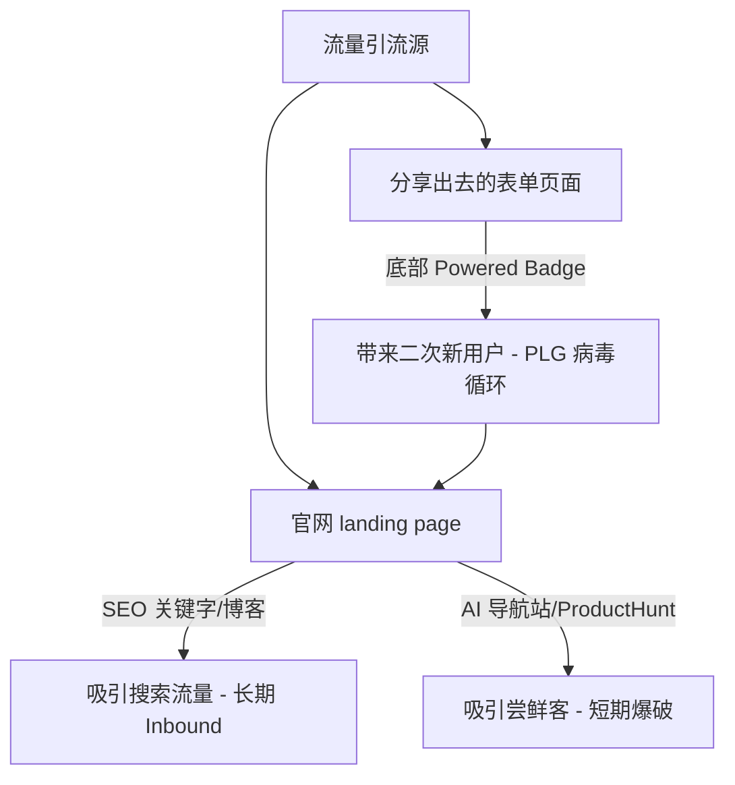

# GenForms (AI FormFactory) 体系化流量增长与运营策略指南

流量运营是一个长期且需要持续沉淀的过程。为了给系统注入良性增长源泉，我们需要从**产品内循环（Viral Loops）**、**内容型 SEO（Inbound）**、**渠道分发与外链（Outbound）** 以及**冷启动导航收录（Directories）** 四个维度建立起体系化的运营矩阵。

本指南分为四个核心战略模块，旨在为 `genforms.ai` 建立可持续的流量飞轮。

---

---

## 一、 病毒传播循环：优化 PLG（产品驱动增长）漏斗

表单类产品天然具备强烈的 **自传播属性（Viral Loop）** —— 每一个被分享出去的表单，都是一个天然的广告位。

### 1. 提升“Powered by AI FormFactory”徽章转化率
我们已经在线上集成了 theme-adaptive（主题自适应）的底部徽章。要将这个漏斗效果最大化：
*   **文案 A/B 测试**：
    *   中文版候选文案：`“由 AI FormFactory 驱动 - 免费制作高颜值表单”` / `“我也想用 AI 一句话生成这种分步表单 🪄”`。
    *   英文版候选文案：`“Powered by AI FormFactory - Create yours free”` / `“Create interactive forms like this in 1 minute with AI ⚡”`。
*   **跳转路径优化**：
    *   徽章点击后，应直接跳转到 `https://genforms.ai/zh/forms/new?prompt=...` 或模板落地页，让受众在“惊艳于表单视觉效果”的瞬间，直接体验“一句话生成”的魅力，实现即刻转化。

### 2. 精致的“电子票据/分享卡片”社交分享
在填写成功的票据组件（如参会电子胸牌）上，提供 `[一键生成精美图片并分享到 Twitter / 小红书 / 朋友圈]` 的按钮。高颜值的毛玻璃票据是绝佳的社交货币，能自发吸引设计界和极客群体的关注。

---

## 二、 搜索引擎优化 (SEO)：构建长效 Inbound 流量

广告买量成本高昂且停滞即失效，而 SEO 能带来持久的、复利式增长。

### 1. 模板页的“程序化 SEO”（Programmatic SEO）
Next.js 的动态路由极其适合做程序化 SEO：
*   **原理**：根据用户常搜索的表单细分词，自动生成数百个高排名的模板详情页（例如 `https://genforms.ai/templates/conference-registration-form`）。
*   **实施**：在数据库中沉淀大量模板，利用 Next.js ISR（增量静态生成）生成诸如：
    *   *“2026 Tech Conference Attendance Form with Digital Badge”*
    *   *“Premium Coffee Shop Customer Feedback Form Template (Cyberpunk theme)”*
    这些极度细分的关键词竞争较小，容易排在 Google 首页，精准捕获寻找表单模版的用户。

### 2. 博客与比较型文章（Comparison Marketing）
在 `/blog` 下定期发布高质量内容，捕获高意向用户的对比流量：
*   **对比词挖掘**：如 *“Typeform vs Google Forms vs AI FormFactory”*、*“How to create interactive forms with DeepSeek & Next.js”*。
*   **痛点切入**：撰写关于 *“How to set up webhook notifications to Feishu/DingTalk for form submissions”* 的技术博文。这些文章会吸引需要复杂集成方案的“高意向企业级客户”。

---

## 三、 冷启动突破：提交全球 AI 导航站与导航目录

在全球和中文互联网上，有大量专门收集新工具、AI 应用的评测与导航目录。首批提交不仅能带来瞬时曝光，还能为我们的域名争取到极其宝贵的**高质量反向链接（Backlinks）**，快速提升域名的 Google 权重（Domain Authority）。

### 1. 全球顶级 AI 导航站提交清单
*   **ProductHunt (producthunt.com)**：全球科技硬件/SaaS 新品发布的绝对主战场。需要准备好精美的 Demo 视频和 Landing Page，挑选周二或周四在北美时间凌晨发布。
*   **There's An AI For That (thereisanaiforthat.com)**：全球流量最大的 AI 工具检索库，对 SEO 权重提升极大。
*   **Futurepedia (futurepedia.io)**：主流 AI 目录之一，收录快，分类精准。
*   **AlternativeTo (alternativeto.net)**：用户寻找替代品的首选平台。我们需要主动去创建词条，并打上 `“Alternative to Typeform”`、`“Alternative to Jotform”` 标签。
*   **Toolify (toolify.ai)**：自动抓取和收录的 AI 平台，流量极高。

### 2. 国内平台与社区收录
*   **小众软件 (appinn.com)**：国内最老牌的软件推荐站，读者多为极客，对高颜值分步表单接受度极高。
*   **少数派 (sspai.com)**：写一篇关于 *“如何利用 AI Agent 编排一句话创建可视化收集场景”* 的效率方法论文章投递，容易引流精准的产品经理与行政运营群体。
*   **V2EX (v2ex.com)**：在 `Creative` 或 `Showcase` 节点发帖（Build in Public），邀请程序员和设计师试用，收集反馈的同时收获首批忠实种子用户。

---

## 四、 社群与被动引流：Reddit 与 Quora 营销 (Be helpful first)

在各大问答社区中，每天都有大量用户在寻找表单解决方案。我们应当采取 **“提供价值，顺便带货”** 的策略：

### 1. Reddit 营销（极其敏感，切忌硬广）
*   **核心板块**：`r/SaaS` (创业)、`r/sideproject` (旁支项目)、`r/webdev` (网页开发)、`r/nocode` (无代码)。
*   **操作手法**：
    *   在 `r/sideproject` 中发帖分享：“*I built a Typeform alternative with glassy themes and visual AI generation because I got tired of Typeform's expensive pricing. Here is the stack...*”。这种“独立创客 Build in Public”的故事极受欢迎。
    *   搜索 "Typeform alternative" 或 "interactive form builder"，主动在回帖中帮助用户解决问题，提供方案并顺带提及 GenForms。

### 2. Quora 与知乎技术解答
*   **问题筛选**：回答“*What is the best alternative to Typeform?*”、“*How do I collect file uploads securely on a web page?*”等问题。
*   **文章沉淀**：展示 GenForms 动态生成表单、OCR 自动提取单据填单的动图（GIF），通过强烈的视觉冲击吸引读者点击链接体验。

---

## 五、 体系化执行时间表 (Milestones)

| 阶段 | 周期 | 核心动作 | 预期产出 |
| :--- | :--- | :--- | :--- |
| **第一阶段：冷启动收录** | 第 1 - 2 周 | 1. 提交至 top 10 个 AI 目录站 2. 在 V2EX/少数派发布尝鲜帖 | 获得首批高质量外链，域名权重突破 10+，捕获首批 100+ 种子用户 |
| **第二阶段：漏斗优化** | 第 3 周 | 1. 观察 GA4 实时转化率 2. 调整 Powered 徽章的跳转和文案 | 优化 PLG（产品驱动增长）转化率，降低流失率 |
| **第三阶段：内容与 SEO** | 第 4 - 8 周 | 1. 上线首批 30 个表单模板 SEO 落地页 2. 产出 5 篇对比或集成博客 | 开始在特定垂直词（如 Feishu Form Webhook）占据 Google 前三页 |
| **第四阶段：平台爆破** | 第 3 个月 | 在 ProductHunt 进行正式 Launch 产品发布 | 单日引流 2000+ IP，冲击当日产品榜 Top 5 |
